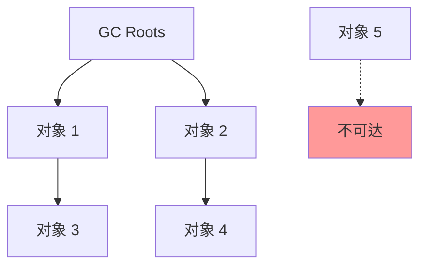

## 前言

面试官问你 JVM GC 时，到底在问什么？

这篇文章用**一张图 + 三个层次**讲清楚垃圾回收。

---

## 一、为什么要 GC？

### 1.1 核心问题

```
堆内存有限 + 对象不断创建 = 内存溢出（OOM）
```

### 1.2 GC 要解决什么？

- **哪些内存需要回收？** → 对象存活判定
- **什么时候回收？** → GC 触发时机
- **如何回收？** → GC 算法

---

## 二、对象存活判定

### 2.1 引用计数法（Reference Counting）

```java
// 简单但无法解决循环引用
class A {
    B b;
}
class B {
    A a;
}

// a 和 b 相互引用，计数器永远 > 0
A a = new A();
B b = new B();
a.b = b;
b.a = a;
```

**缺点**：循环引用导致内存泄漏

### 2.2 可达性分析（Root Searching）

**GC Roots** 包括：
- 虚拟机栈（栈帧中的本地变量表）
- 方法区中类静态属性引用的对象
- 方法区中常量引用的对象
- 本地方法栈中 JNI 引用的对象



---

## 三、GC 算法

### 3.1 标记-清除（Mark-Sweep）

```
标记阶段：标记所有存活对象
清除阶段：回收未标记对象
```

**缺点**：产生大量内存碎片

### 3.2 复制算法（Copying）

```
将存活对象复制到另一块空间
```

**优点**：无碎片
**缺点**：内存利用率低（浪费一半）

**适用场景**：新生代（Survivor 区）

### 3.3 标记-整理（Mark-Compact）

```
标记存活对象 → 移动到一端 → 清理边界
```

**优点**：无碎片
**缺点**：移动对象成本高

**适用场景**：老年代

### 3.4 分代收集

```
新生代：复制算法（短命对象多）
老年代：标记-整理/标记-清除
```

---

## 四、常见 GC 收集器

### 4.1 Serial 收集器

- 单线程，Stop The World
- 适合客户端模式
- 新生代 + 老年代

### 4.2 Parallel 收集器（JDK 8 默认）

- 多线程并行回收
- 关注**吞吐量**
- `-XX:+UseParallelGC`

### 4.3 CMS 收集器（Concurrent Mark Sweep）

- **低延迟**，与用户线程并发执行
- **三色标记** + **增量更新**
- 已被 G1 取代（JDK 9 标记废弃，JDK 14 移除）

### 4.4 G1 收集器（JDK 9+ 默认）

```
Region 划分 → 可预测停顿 → 无碎片
```

**核心特点**：
- 化整为零：将堆划分为多个 Region
- 可预测停顿：`-XX:MaxGCPauseMillis=200`
- 优先回收垃圾最多的 Region

**适用场景**：大堆内存（> 6GB）

---

## 五、GC 日志分析

### 5.1 开启 GC 日志

```bash
# JDK 8
-XX:+PrintGCDetails -XX:+PrintGCDateStamps

# JDK 9+
-Xlog:gc*:file=gc.log
```

### 5.2 关键指标解读

```
[GC (Allocation Failure) [PSYoungGen: 2048K->512K(2560K)]
 2048K->768K(9728K), 0.0034567 secs]
```

解读：
- `GC (Allocation Failure)`：YGC，因分配对象失败触发
- `PSYoungGen: 2048K->512K`：新生代回收前→回收后
- `2048K->768K(9728K)`：整个堆的变化
- `0.0034567 secs`：耗时

---

## 六、性能调优思路

### 6.1 调优目标

| 场景 | 目标 | 关注指标 |
|------|------|---------|
| Web 应用 | 低延迟 | GC 停顿时间 |
| 批处理 | 高吞吐 | GC 总耗时占比 |
| 大数据 | 避免 Full GC | 老年代使用率 |

### 6.2 常见问题排查

**问题 1：频繁 Full GC**

```
原因：老年代不足
解决：调大老年代或降低晋升年龄
-XX:MaxTenuringThreshold=15
```

**问题 2：YGC 频繁但耗时短**

```
原因：新生代太小
解决：调大新生代
-Xmn2g
```

**问题 3：OOM 但堆未满**

```
原因：内存泄漏或元空间不足
排查：
1. jmap -heap 查看堆使用
2. jmap -histo 查看对象分布
3. VisualVM/MAT 分析 dump
```

---

## 七、面试回答模板

**Q：讲讲你对 JVM GC 的理解**

> **一句话结论**：GC 通过可达性分析判断对象存活，用分代思想配合不同算法回收内存。
>
> **原理拆解**：
> 1. 新生代用复制算法（存活率低），老年代用标记-整理（存活率高）
> 2. 常用 G1 收集器，Region 划分实现可预测停顿
>
> **实战经验**：
> - 调优时先用 `jstat -gc` 监控 GC 频率
> - Full GC 过多调 `-XX:MaxTenuringThreshold`
> - 大堆（> 8GB）优先用 G1，小堆用 Parallel

---

## 总结

| 要点 | 记忆关键词 |
|------|----------|
| 判定方式 | 可达性分析 |
| 核心思想 | 分代收集 |
| 新生代算法 | 复制 |
| 老年代算法 | 标记-整理 |
| 生产首选 | G1 |
| 调优工具 | jstat、jmap、VisualVM |

---

## 参考文档

- [JVM 规范](https://docs.oracle.com/javase/specs/jvms/se8/html/)
- [G1 GC 调优指南](https://docs.oracle.com/javase/9/gctuning/)
