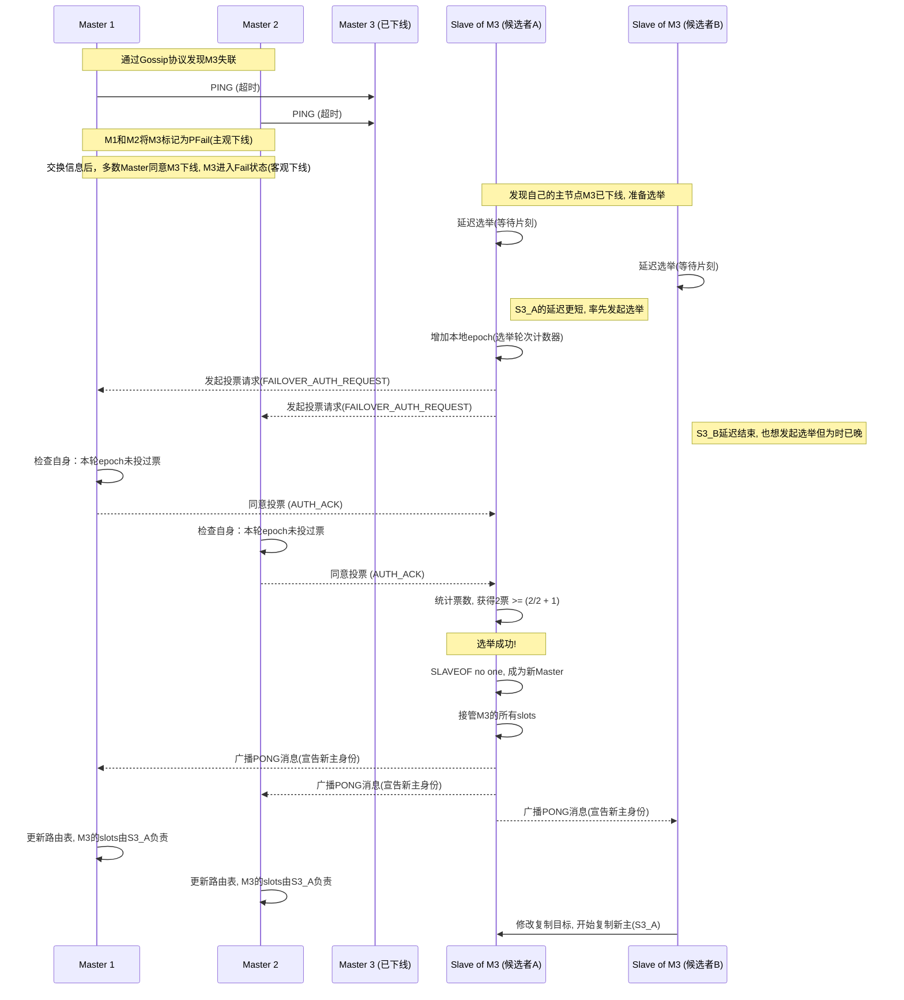

.png)

## 目录

- [IO 模型](#io)
  - [阻塞IO](#阻塞io)
  - [非阻塞IO](#非阻塞io)
  - [IO多路复用](#io多路复用)
    - [select](#select)
    - [poll](#poll)
    - [epoll](#epoll)
    - [红黑树原理](#红黑树原理面试常问)
    - [Redis网络模型](#redis网络模型流程)
  - [信号驱动IO](#信号驱动io)
  - [异步IO](#异步io)
  - [同步vs异步](#如何区分同步和异步)
- [Redis单多线程](#redis是单线程还是多线程)
- [数据结构](#redis数据结构)
  - [String](#string)
  - [List](#list)
    - [压缩列表](#压缩列表ziplist)
    - [quicklist](#quicklist)
    - [listpack](#listpackredis7)
  - [Set](#set)
  - [Hash](#hash)
    - [渐进式扩容](#hashtable渐进式扩容)
  - [ZSet](#zset)
    - [跳表](#跳表skiplist)
- [过期策略](#redis过期策略)
- [内存淘汰策略](#redis内存淘汰策略)
- [持久化](#aof记录写操作持久化这部分很重要)
  - [AOF](#aof记录写操作持久化这部分很重要)
  - [RDB](#rdb记录二进制数据)
  - [过期键处理](#aof-和-rdb-对过期键的处理)
  - [混合持久化](#混合持久化现代生产环境推荐)
- [事务](#redis的事务)
- [高可用](#redis高可用)
  - [主从复制](#主从复制会有主从数据不一致的情况)
  - [哨兵机制](#哨兵机制)
  - [Cluster集群](#cluster集群)
- [应用场景](#redis应用场景)
  - [缓存](#缓存)
    - [缓存雪崩](#缓存雪崩)
    - [缓存击穿](#缓存击穿)
    - [缓存穿透](#缓存穿透)
    - [布隆过滤器](#布隆过滤器)
    - [一致性](#一致性问题)
  - [Redisson分布式锁](#redisson分布式锁)
- [场景题](#redis场景题)
  - [大Key预防](#如何预防大key)
  - [大Key对持久化的影响](#大key对持久化的影响)
  - [大Key安全删除](#redis大key删除导致集群崩溃如何避免)
  - [事务ACID对比](#redis-和-mysql-事务的-acid-的区别)
  - [缓存一致性方案](#缓存与数据库一致性方案)
- [Top 20面试题](#-redis-top-20-面试题速查)

---

## Io

### 阻塞IO


### 非阻塞IO


第一阶段是非阻塞的，但是第二阶段还是要阻塞等待内核把数据准备好（其实这种方式没提升什么性能，反而会因为忙等，也就是反复询问而占用cpu）

### IO多路复用

无论是阻塞IO还是非阻塞I0,用户应用在一阶段都需要调用recvfrom来获取数据,差别在于无数据时的处理方案:

- 如果调用recvfrom时,恰好没有数据,阻塞IO会使进程阻塞,非阻塞IO使CPU空转,都不能充分发挥CPU的作用。
- 如果调用recvfrom时,恰好有数据,则用户进程可以直接进入第二阶段,读取并处理数据

比如服务端处理客户端Socket请求时,在单线程情况下,只能依次处理每一个socket,如果正在处理的socket恰好未就绪(数据不可读
或不可写),线程就会被阻塞,所有其它客户端socket都必须等待,性能自然会很差。


不同监听fd的方式、通知的方式又有多种实现，常见的有

- select
- poll
- epoll


#### select

是Linux中最早的IO多路复用的实现方案：


其实在操作系统内部是通过一个数组来保存需要监听的实例的，但不同的是，这里的数组是作为位图来使用的，这样就可以用较小的空间来监听很多个fd

具体过程如下：


到了1.3后，将该数组传入内核空间，然后内核空间遍历一遍得到已就绪的，并把未就绪的重新置为0，并把这个结果返回到用户空间，用户空间还要再遍历一遍才能知道哪些fd已就绪。

所以select性能相对其他方式还是比较差的。

select模式存在的问题:

- 需要将整个fd_set从用户空间拷贝到内核空间,select结束还要要再次拷贝
  回用户空间
- select无法得知具体是哪个fd就绪,需要遍历整个fd_set
- fd_set监听的fd数量不能超过1024

#### poll

poll模式对select模式做了简单改进,但性能提升不明显,部分关关键代码如下:


IO流程:
1、创建pollfd数组,向其中添加关注的fd信息,数组大小自定义

2、调用poll函数,将pollfd数组拷贝到内核空间,转链表存储,无上限

3、内核遍历fd,判断是否就绪

4、数据就绪或超时后,拷贝pollfd数组到用户空间,返回就绪fd数量n

5、用户进程判断n是否大于0

6、大于0则遍历pollfd数组,找到就绪的fd

`相对于select，其实就仅仅是扩大了数组能监听的数量[采用链表的方式]，理论上讲空间无上限`

与select对比:

- select模式中的fd_set大小固定为1024,而pollfd在内核中采用`链表`,理论上无上限
- 监听FD越多,每次遍历消耗时间也越久,性能反而会下降

#### epoll


1、创建eventpoll结构体，返回对应句柄

2、将fd都加入红黑树中，并设置callback方法（这个方法很简单，就是在该fd就绪时将其放入到rb_list中）

3、然后用户空间执行epoll_wait方法等待fd就绪，从上面图上能看出epoll_event其实是一个指向rb_list的指针，所以能够很快的拿到其中的fd，并对其进行相应处理

#### 红黑树原理（面试常问）

**为什么 epoll 使用红黑树而非其他平衡树？**

对比三种常见平衡树：

| 特性 | AVL树 | 红黑树 | B树/B+树 |
|------|-------|--------|----------|
| 平衡性 | 严格平衡（高度差≤1） | 近似平衡（黑节点高度相等） | 平衡（多路搜索树） |
| 查找复杂度 | O(logN) | O(logN) | O(logN) |
| 插入/删除 | 频繁旋转，性能不稳定 | 最多旋转2次，性能稳定 | 需要分裂/合并节点 |
| 适用场景 | 读多写少 | 读写均衡 | 磁盘存储 |

**epoll 选择红黑树的核心原因：**

1. **fd 频繁添加和删除**：客户端连接建立/断开频繁，红黑树的插入删除操作更稳定（旋转次数≤2）
2. **查找性能足够**：O(logN) 的查找复杂度对于管理大量 fd 完全够用
3. **实现相对简单**：相比 AVL 树的严格平衡，红黑树实现更简单
4. **内存开销小**：每个节点只需额外存储1 bit 的颜色信息

**红黑树的5个性质（面试背诵）：**
1. 每个节点要么红色，要么黑色
2. 根节点是黑色
3. 所有叶子节点（NIL）是黑色
4. 红节点的两个子节点都是黑色（不能有连续红节点）
5. 从任一节点到其每个叶子的所有路径都包含相同数目的黑节点

**时间复杂度保证：**
- 查找：O(logN)
- 插入：O(logN)
- 删除：O(logN)


这涉及两种事件的通知机制：

- **水平触发**(level-triggered) 称作 LT 模式。只要缓冲区有数据，事件就会一直发生
- **边缘触发**(edge-triggered) 称作 ET 模式。缓冲区有数据，仅会触发一次。事件想要再次触发，必须先将 fd 中的数据读完才行


#### Redis网络模型流程


> 分别
>
> 处理连接应答，有新连接就放入对应的fd，并返回连接成功
>
> 处理命令请求，这里先使用了多线程对解析请求并生成命令之类的，都写入缓冲区，事先准备好，给主线程进行执行，执行好后加入到一个队列中
>
> 处理命令回复，拿到上面的队列，使用多线程进行回复

> ---
>
> ## 🧠 Redis 多线程网络模型的核心思想
>
> Redis 在 **6.0 版本**中引入了 **I/O threading（I/O 多线程）机制**，用于提升在网络密集型场景下的性能。但需要注意的是：
>
> > ✅ **只有网络 I/O 操作使用了多线程，命令执行依然是单线程处理。**
>
> ---
>
> ## 📌 整体流程分步详解
>
> ### 🔹 步骤一：初始化阶段（主线程）
>
> 1. **启动 Redis 主线程**
>    - 初始化事件循环（Event Loop）
>    - 创建多个 I/O 线程（数量由 `io-threads` 配置决定，默认为 1，即关闭多线程）
>    - 所有 I/O 线程进入等待状态，等待主线程分配任务
>
> 2. **监听客户端连接**
>    - 主线程绑定并监听 Redis 的 TCP 端口
>    - 注册可读事件到事件循环中（如 `accept()` 事件）
>
> ---
>
> ### 🔹 步骤二：新连接建立（主线程）
>
> 1. **客户端发起连接**
>    - TCP 三次握手完成后，服务端 socket 触发可读事件
>
> 2. **主线程 accept() 接收连接**
>    - 主线程调用 `accept()` 获取客户端 socket fd
>    - 设置非阻塞模式，并注册该 socket 的可读事件（表示“客户端有数据要发送”）
>
> 3. **加入事件循环**
>    - 将客户端 socket 加入事件循环（epoll/kqueue/select），等待下次可读事件触发
>
> ---
>
> ### 🔹 步骤三：客户端请求到达（主线程分发）
>
> 1. **客户端发送请求（如 SET key value 或 GET key）**
>    - 客户端 socket 变为可读状态，触发事件循环通知
>
> 2. **主线程检测到可读事件**
>    - 主线程遍历所有已就绪的客户端 socket
>    - 根据当前 I/O 线程数量，将这些 socket 分配给不同的 I/O 线程进行并发处理
>
> ---
>
> ### 🔹 步骤四：I/O 线程读取 & 解析请求（多线程）
>
> 1. **I/O 线程开始工作**
>    - 每个 I/O 线程从自己负责的 socket 中读取数据（调用 `read()`）
>
> 2. **解析请求内容**
>    - 将原始字节流解析为 Redis 协议格式（如 RESP 协议）
>    - 构建出完整的命令结构（如 `argv[]`, `argc`）
>
> 3. **放入待处理队列**
>    - 将解析好的请求放入一个全局的 **pending list（待处理队列）**
>
> ---
>
> ### 🔹 步骤五：主线程执行命令（单线程）
>
> 1. **主线程逐个取出请求**
>    - 从 pending list 中取出解析好的命令请求
>
> 2. **执行命令逻辑**
>    - 调用相应的命令处理函数（如 `setCommand()`、`getCommand()`）
>    - 修改数据库、更新过期时间、记录 AOF 缓冲等操作都在此完成
>
> 3. **生成响应结果**
>    - 将命令执行结果缓存到客户端的输出缓冲区（output buffer）
>
> ---
>
> ### 🔹 步骤六：I/O 线程写回响应（多线程）
>
> 1. **主线程通知 I/O 线程可以写回响应**
>    - 主线程通过事件机制或直接唤醒方式通知 I/O 线程
>
> 2. **I/O 线程并发发送响应**
>    - 每个 I/O 线程将其负责的客户端的响应数据写回 socket（调用 `write()`）
>
> 3. **响应发送完毕后**
>    - 如果还有未发送完的数据，继续注册写事件，直到全部发送完成
>    - 否则，取消写事件注册，释放资源
>
> ---
>
> ## 🎯 补充说明：线程间协作机制
>
> - Redis 使用 **无锁队列 + 内存屏障** 实现线程间通信
> - 主线程和 I/O 线程之间通过共享内存交换数据，但不会出现竞争问题
> - 因为 I/O 线程只处理网络 I/O，不涉及实际数据修改，所以无需加锁
>
> ---
>
> ## 📋 总结：Redis 多线程网络模型的完整流程图（文字版）
>
> ```
> [客户端] ——(TCP连接)——> [主线程 accept()]
>              ↓
> [主线程注册可读事件]
>              ↓
> [客户端发送请求] ——> [socket变为可读]
>              ↓
> [主线程检测事件] ——> [分发给 I/O 线程]
>              ↓
> [I/O 线程 read() 请求] ——> [解析成命令结构]
>              ↓
> [放入 pending list 队列]
>              ↓
> [主线程顺序执行命令] ——> [修改数据库、生成响应]
>              ↓
> [响应写入客户端 output buffer]
>              ↓
> [主线程唤醒 I/O 线程]
>              ↓
> [I/O 线程 write() 回复客户端]
> ```
>
> ---
>
> ## ⚙️ 配置建议（redis.conf）
>
> ```conf
> # 开启 I/O 多线程，一般设为 CPU 核心数（逻辑核心）
> io-threads 4
> 
> # 设置为 all 表示 I/O 多线程同时处理读和写
> io-threads-do-reads no
> ```
>
> 默认情况下，Redis 的 I/O 多线程仅用于 **写操作（发送响应）**，如果想用于 **读操作（接收请求）**，需要设置：
>
> ```conf
> io-threads-do-reads yes
> ```
>
> ---
>
> ## ✅ 最终总结一句话：
>
> > Redis 的多线程网络模型通过将网络 I/O 操作（请求读取和响应写回）交给多个线程并发处理，而将命令执行保留为主线程串行处理，从而在保持数据一致性和实现简洁性的同时，显著提升了高并发场景下的吞吐能力。


### 信号驱动IO


### 异步IO


异步IO很牛逼，但要是并发很多，如果我们为每个请求创建一个线程来处理（同步阻塞模型），就会开启很多线程，撑爆系统。要使用异步IO这种方法，需要配合回调或事件循环，实现起来复杂

#### 如何区分同步和异步


## Redis是单线程还是多线程？

回答：

Redis的核心命令处理一直都是单线程的

再其他部分适当引入了多线程，比如删除，先用标记进行逻辑删除，再用一个子线程异步进行删除

6.0版本之后，在网络io中也引入了多线程，但也仅仅是在处理收发网络请求时时使用到了多线程，比如接受各种网络请求，收发数据，等等这些操作，我记得好像在请求处理完成之后会放到一个队列里，供主线程进行一些命令的操作


> 在6.0后引入多线程时，使用到了io多路复用技术


## Redis数据结构


### String

其实就是完善了c中字符串的缺陷，如使用“\0”作为结束符；不能动态扩容；获取字符串长度需要遍历，复杂度为O(n)；

所以Redis设计了SDS这种数据结构，结构如图：


sds类型有sdshdr5、sdshdr8、sdshdr16、sdshdr32、sdshdr64，分别能表示2^5,2^8...这么多的空间

这种数据结构可以存储任意格式的二进制数据

动态扩容：不足1M时、先计算要扩容到多大，再翻倍；满足1M时、先计算需要扩容到多大，在此基础上再加1M


*<u>如果保存的是数字，并且可以用long类型标识，那么就会用int类型来存储该字符串</u>*

*<u>如果存的是个字符串，并且长度小于一个值，那就会用SDS来保存这个字符串，编码使用embstr，这种编码是专门用于保护短字符串的，大于这个值就会使用raw格式。</u>*

> EMBSTR<u>*优点*</u>是redisObject和SDS两个结构可以一次性分配空间,<u>*缺点*</u>在于如果重新分配空间,整体都需要再分配,所以<u>***EMBSTR设计为只读,***</u>任何写操作之后EMBSTR者都会变成RAW,理念是发生过修改的字符串通常会认为是易变的。

**<u>*INT / embstr -> raw*</u>**


### List

#### 压缩列表（Ziplist）

> **适用条件（Redis 5/6 默认配置）**：
>
> - 列表中元素数量 ≤ `list-max-ziplist-entries`（默认为 512）
> - 每个元素的长度 ≤ `list-max-ziplist-value`（默认为 64 字节）
>
> 这俩条件都满足才用，否则使用quickList，（3.2老版本之前就该用链表）


类似数组，结构如下：

【zlbytes， zltail， zllen， entry1，...， entryN， zlend】


zlbytes：记录整体占用堆内存的字节数

zltail：压缩列表的尾部相对于起始地址的偏移量

zllen：节点数量

zlend：压缩列表结束点


在压缩列表中，如果我们要査找定位第一个元素和最后一个元素，可以通过表头三个字段(zlen)的长度直接定位，复杂度是 O(1)。`而查找其他元素时，就没有这么高效了，只能逐个查找，此时的复杂度就是O(N)了，因此压缩列表不适合保存过多的元素。`

entry的构成如下：


【prevlen， encoding， data】

prevlen：记录前一个节点的长度，为了反向遍历，要是没有这个，可能不能实现反向遍历

encoding：记录了当前节点实际数据的「类型和长度」，类型主要有两种:字符串和整数。

data：记录了当前节点的实际数据，类型和长度都由 encoding 决定;


**压缩列表的缺陷**
    空间扩展操作也就是重新分配内存，因此连锁更新一旦发生，就会导致压缩列表占用的内存空间要多次重新分配，这就会直接影响到压缩列表的访问性能。
    所以说，虽然压缩列表紧凑型的内存布局能节省内存开销，但是如果保存的元素数量增加了，或是元素变大了，会导致内存重新分配，最糟糕的是会有**「连锁更新」**的问题。
    因此，压缩列表只会用于保存的节点数量不多的场景，只要节点数量足够小，即使发生连锁更新，也是能接受的。

`ziplist` 的设计非常紧凑，当在中间插入或删除一个元素时，其后的所有元素都需要进行内存移动。<u>*更糟糕的是，如果插入一个元素导致某个节点的元数据长度发生变化（比如从1字节变成5字节），可能会像多米诺骨牌一样，引发后续所有节点的**连锁更新***</u>，这使得修改操作的时间复杂度最坏可以达到 O(N2)。


#### quicklist

 **quicklist**，它是一个由多个 `ziplist` 组成的双向链表。这样既保留了 ziplist 的内存效率，又避免了单个 ziplist 过大导致的性能问题。


#### listpack（Redis7）

Redis5.0提出的新设计，为了替代压缩列表，解决其连锁更新的问题，它最大特点是 listpack 中每个节点不再包含前一个节点的长度了，压缩列表每个节点正因为需要保存前一个节点的长度字段，就会有连锁更新的隐患。


> 🔍 连锁更新（Cascade Update）的本质问题在于：
> 不是移动内存本身导致性能差
> 而是判断和`更新 prevlen`的过程不可控、不确定，带来了额外的复杂度和性能抖动


> 💡 Listpack 是怎么解决这个问题的？
>
> listpack 中不再保存 `prevlen`，每个节点只记录自己的总长度 `len`，查找下一个节点只需加上当前节点的 `len` 即可。
>
> 这样就不需要依赖任何前置字段，也不会出现因为插入/删除而造成一连串的字段更新。


**listpack结构**

listpack 采用了压缩列表的很多优秀的设计，比如还是用一块连续的内存空间来紧凑地保存数据，并且为了节省内存的开销，listpack 节点会采用不同的编码方式保存不同大小的数据。


listpack 头包含两个属性，分别记录了 listpack 总字节数和元素数量，然后 listpack 末尾也有个结尾标识。图中的 listpack entry 就是 listpack 的节点了。

**每个节点的结构如下：**


主要包含三个方面内容：

- encoding，定义该元素的编码类型，会对不同长度的整数和字符串进行编码；
- data，实际存放的数据；
- len，encoding+data的总长度；

可以看到，listpack 没有压缩列表中记录前一个节点长度的字段了，listpack 只记录当前节点的长度，当我们向 listpack 加入一个新元素的时候，不会影响其他节点的长度字段的变化，从而避免了压缩列表的连锁更新问题。


> **找到上一个节点的秘密就藏在element-tot-len:**
>
> `element-tot-len`所占用的每个字节的第一个bit用于标识是否结列束。0是结束,1是继续,剩下7个bit来存储数据大小。当我们需要找到当前元素的上一个元素时,我们可以从后向前前依次查找每个字节,找到上一个Entry的`element-tot-len`字段的结束标识,就可以算出上一个节点的首位置了。
>
> 举个例子:
>
> 如果上个节点的`element-tot-len`为`00000001 10000100`,每个字节第一个bit标志是否结束,所以这里的element-tot-len一共就两个字节,大小0000001 
>
> 0000100,即132字节。


### Set

Set底层也是两种数据结构

如果集合都是整数且数量不超过512，就使用intset数据类型（<u>*排列紧凑，查找的时候要使用二分*</u>）（这种时候是有序）

否则就用哈希表


### Hash

**底层原理：**

> **Hash底层有两种编码结构，一个是压缩列表（`ZIPLIST`），一个是`HASHTABLE`。同时满足以下两个条件，用压缩列表：**
>
> 1. Hash对象保存的所有值和键的长度都小于64字节；
> 2. Hash对象元素个数少于512个。
>
> 两个条件任何一条不满足，编码结构就用HASHTABLE。


用ZIPLIST的时候实际上就是把kv对存进ZIPLIST，然后查询的时候遍历，只有数据量小才用ZIPLIST，不会有性能压力


### HashTable渐进式扩容

渐进式扩容通过维护**两个哈希表**来工作：一个旧的（ht[0]）和一个新的（ht[1]）。整个流程可以分为三个阶段：

#### 阶段一：准备扩容 (Preparation)

1. **触发条件**：当哈希表的**负载因子**（Load Factor = 已存储元素数量 / 哈希表容量）超过预设的阈值时，扩容被触发。
2. **分配新表**：系统会分配一个新的、更大的哈希表（`ht[1]`）。通常大小是旧表（`ht[0]`）的两倍或更大。
3. **设置状态**：系统会设置一个状态标记，表明当前正处于“重哈希”（re-hashing）状态。同时，会有一个索引（比如 `rehashidx`）被初始化为 0，用来追踪迁移进度。此时，`ht[0]` 仍然是主表，但 `ht[1]` 已经准备就绪。

- `ht[0]`：旧的、数据待迁移的哈希表。
- `ht[1]`：新分配的、更大的哈希表。
- `rehashidx`：一个计数器/指针，记录 `ht[0]` 中下一个待迁移的桶（bucket）的索引。初始为 0。

------

#### 阶段二：迁移进行中 (Migration in Progress)

这是整个流程最核心的部分。在 `rehashidx` 从 0 增长到 `ht[0]` 的大小减 1 的这个过程中，哈希表对外提供的服务（增、删、查、改）会遵循以下特殊规则：

1. **写入操作 (Add/Insert/Update)**
   - **一律写入新表 (`ht[1]`)**。
   - **原因**：新来的数据直接放入新表，可以避免“刚插入旧表，马上又要移到新表”的无效操作。这保证了旧表的数据只会减少，不会增加，最终迁移必然会完成。
2. **查找/读取操作 (Find/Read)**
   - **先查旧表 (`ht[0]`)，再查新表 (`ht[1]`)**。
   - **原因**：一个键值对要么还在旧表（尚未被迁移），要么已经被迁移到了新表。所以必须检查两个地方才能确定它是否存在。
3. **删除操作 (Delete)**
   - 与查找类似，**同时尝试从旧表 (`ht[0]`) 和新表 (`ht[1]`) 中删除**。这样可以确保无论目标键在哪里，都能被成功删除。
4. **数据迁移本身 (The "Progressive" Part)**
   - 迁移不是一次性完成的，而是“小步快跑”。有两种常见的方式来驱动迁移：
     - **主动迁移（Active Re-hashing）**：每次执行一个**写、读或删除**操作时，“顺便”将 `ht[0]` 中 `rehashidx` 指向的一个或多个桶（bucket）中的所有数据迁移到 `ht[1]` 中，然后将 `rehashidx` 加一。这样，迁移的成本就被**摊销**到了每一次用户请求上。
     - **被动迁移（Passive Re-hashing）**：系统会有一个后台任务（例如每隔一段时间执行的定时任务），该任务会检查是否处于重哈希状态。如果是，它会主动迁移一部分数据，确保即使在系统空闲时，迁移工作也能持续进行，最终完成。
   - 迁移一个桶的过程是：<u>*遍历该桶（链表）上的所有键值对，重新计算每个键在新表 `ht[1]` 中的哈希位置，并将其插入。*</u>

------

#### 阶段三：迁移完成 (Completion)

1. **完成标志**：当 `rehashidx` 的值等于 `ht[0]` 的大小时，意味着 `ht[0]` 中所有的数据都已成功迁移到 `ht[1]`。
2. **切换与释放**：
   - 将 `ht[1]` 设置为系统的主哈希表（现在它成为新的 `ht[0]`）。
   - 释放旧表 `ht[0]` 的内存。
   - 重置重哈希状态标记和 `rehashidx`。

此时，哈希表恢复到正常状态，只使用一个哈希表对外提供服务，直到下一次扩容被触发。

### Zset

> 为了更深入地理解，我们来剖析一下 `zset` 的需求和跳表是如何完美满足这些需求的。
>
> ------
>
> ### 1. `zset` 的核心需求
>
> 一个 `zset` 需要同时满足两种高效查询的需求：
>
> 1. **按成员（member）查找**：能够快速地通过 `member` 找到其对应的 `score`。这本质上是一个键值对查询。
> 2. **按分数（score）范围查找**：能够快速地根据 `score` 的范围或者排名（rank）来查找成员。例如，获取分数在 100 到 200 之间的所有成员，或者获取排名最高的前 10 名成员。这要求数据结构是按 `score` 有序的。
>
> 为了同时满足这两个需求，Redis 实际上为每个 `zset` 内部使用了**两种数据结构**的组合：
>
> - **哈希表 (Hash Table)**：用于存储 `member` 到 `score` 的映射。这使得通过 `member` 查找 `score` 的操作时间复杂度是 $O(1)$。
> - **跳表 (Skip List)**：用于存储 `score` 到 `member` 的映射，并且所有节点按照 `score` 从小到大排序。这满足了所有按序操作的需求。
>
> 这两种结构通过指针相互连接，共享数据（`member` 和 `score`），从而构成了一个功能完备的 `zset`。
>
> 现在，核心问题就变成了：在需要排序的场景下，**为什么选择跳表，而不是更常见的红黑树（Red-Black Tree）等平衡二叉搜索树？**
>
> ------
>
> ### 2. 跳表 vs. 平衡二叉搜索树 (以红黑树为例)
>
> #### (1) 实现的简洁性 (Implementation Simplicity)
>
> - **跳表**：跳表的实现非常直观。它本质上是多层有序链表，底层是所有元素的完整链表，上层是下层的“快速通道”或“索引”。插入和删除节点时，只需要修改相邻节点的指针，不需要像红黑树那样进行复杂的旋转（rotations）和变色（re-coloring）来维持平衡。这使得代码更容易编写、理解和调试。对于追求稳定和高效开发的 Redis 来说，这是一个巨大的工程优势。
> - **红黑树**：红黑树的平衡逻辑非常复杂。插入或删除一个节点后，可能会破坏树的 5 条性质，需要通过一系列的左旋、右旋和颜色调整来重新恢复平衡，这个过程很容易出错。
>
> #### (2) 范围查询的性能 (Range Query Performance)
>
> 这是跳表的一个**巨大优势**。`zset` 有大量的范围查询命令，如 `ZRANGE`, `ZRANGEBYSCORE` 等。
>
> - **跳表**：执行范围查询时，你只需要在跳表中定位到范围的起始点（$O(\log N)$），然后就可以在最底层的链表上向后顺序遍历，直到范围的终点。这个遍历过程是线性的，对 CPU 缓存非常友好（Cache Friendly），因为内存是连续访问的。
> - **红黑树**：在红黑树上进行范围查询，需要进行中序遍历。这个过程可能涉及在树的节点间上下移动，指针的跳转是“之”字形的，内存访问不连续，对 CPU 缓存的利用率不如跳表。

#### Zset底层原理

> 如果满足如下规则,ZSet就用`压缩列表`编码:
>
> 1.列表对象保存的所有字符串对象长度都小于64字节;
>
> 2.列表对象元素个数少于128个。
>
> 两个条件任何一条不满足,编码机构就用跳表 + 哈希表


#### 跳表（Skiplist）


```c
// 跳表节点的数据结构
typedef struct zskiplistNode {
    // Zset 对象的元素值
    sds ele;
    // 元素权重值
    double score;
    // 后向指针
    struct zskiplistNode *backward;

    // 节点的 level 数组，保存每层上的前向指针和跨度
    struct zskiplistLevel {
        struct zskiplistNode *forward;
        unsigned long span;
    } level[];
} zskiplistNode;
```


​    Zset 对象要同时保存「元素」和「元素的权重」，对应到跳表节点结构里就是 sds 类型的 ele 变量和double 类型的 score 变量。`每个跳表节点都有一个后向指针`

`(struct zskiplistNode*backward)，指向前一个节点，目的是为了方便从跳表的尾节点开始访问节点，这样倒序查找时很方便。`

​    跳表是一个带有层级关系的链表，而且每一层级可以包含多个节点，每一个节点通过指针连接起来，实现这一特性就是靠跳表节点结构体中的zskiplistLevel 结构体类型的 

`level 数组。`

​    level 数组中的每一个元素代表跳表的一层，也就是由 zskiplistLevel结构体表示，比如leve[0] 就表示第一层，leve[1]就表示第二层。zskiplistLevel结构体里定义

了「指向下一个跳表节点的指针」和「跨度」，跨度时用来记录两个节点之间的距离。


跳表的结构体

```c
typedef struct zskiplist {
    struct zskiplistNode *header, *tail;
    unsigned long length;
    int level;
} zskiplist;
```

跳表结构里包含了:

- 跳表的头尾节点，便于在O(1)时间复杂度内访问跳表的头节点和尾节点;

- 跳表的长度，便于在O(1)时间复杂度获取跳表节点的数量;

- 跳表的最大层数，便于在O(1)时间复杂度获取跳表中层高最大的那个节点的层数量;

#### 跳表查询过程（从高层开始找）

查找一个跳表节点的过程时，跳表会从头节点的最高层开始，逐一遍历每一层。在遍历某一层的跳表节点时，会用跳表节点中的 SDS 类型的元素和元素的权重来进行判断，共有两个判断条件：

- 如果当前节点的权重「小于」要查找的权重时，跳表就会访问该层上的下一个节点。
- 如果当前节点的权重「等于」要查找的权重时，并且当前节点的 SDS 类型数据「小于」要查找的数据时，跳表就会访问该层上的下一个节点。

如果上面两个条件都不满足，或者下一个节点为空时，跳表就会使用目前遍历到的节点的 level 数组里的下一层指针，然后沿着下一层指针继续查找，这就相当于跳到了下一层接着查找。


#### 跳表的层数设置

最理想的状态是每两层的比例都是2:1，这样查找复杂度可以降低为O（logN）

> 那怎样才能维持相邻两层的节点数量的比例为 2:1 呢？

如果采用新增节点或者删除节点时，来调整跳表节点以维持比例的方法的话，会带来额外的开销。

Redis 则采用一种巧妙的方法是，跳表在创建节点的时候，**随机生成每个节点的层数**，<u>*并没有严格维持相邻两层的节点数量比例为 2:1*</u> 的情况。

具体的做法是，跳表在创建节点时候，会生成范围为[0-1]的一个随机数，如果这个随机数小于 0.25（相当于**概率 25%**），那么层数就增加 1 层，然后继续生成下一个随机数，直到随机数的结果大于 0.25 结束，最终确定该节点的层数。

这样的做法，相当于每增加一层的概率不超过 25%，层数越高，概率越低，`层高最大限制是 64`。

虽然我前面讲解跳表的时候，图中的跳表的「头节点」都是 3 层高，但是其实如果层高最大限制是 64，那么在创建跳表「头节点」的时候，就会直接创建 64 层高的头节点。

如下代码，创建跳表时，头节点的 level 数组有 ZSKIPLIST_MAXLEVEL个元素（层），节点不存储任何 member 和 score 值，level 数组元素的 forward 都指向NULL， span值都为0。

> 为什么Zset用跳表而不是红黑树实现？

- `从内存占用上来比较，跳表比平衡树更灵活一些。`平衡树每个节点包含2个指针（分别指向左右子树），而跳表每个节点包含的指针数目平均为1/(1-p)，具体取决于参数p的大小。如果像Redis里的实现一样，取p=1/4，那么平均每个节点包含1.33个指针，比平衡树更有优势。
- `在做范围查找的时候，跳表比平衡树操作要简单`。在平衡树上，我们找到指定范围的小值之后，还需要以中序遍历的顺序继续寻找其它不超过大值的节点。如果不对平衡树进行一定的改造，这里的中序遍历并不容易实现。而在跳表上进行范围查找就非常简单，只需要在找到小值之后，对第1层链表进行若干步的遍历就可以实现。
- `从算法实现难度上来比较，跳表比平衡树要简单得多`。平衡树的插入和删除操作可能引发子树的调整，逻辑复杂，而跳表的插入和删除只需要修改相邻节点的指针，操作简单又快速。


## Redis过期策略

首先明确一下Redis是怎么存储key的过期时间的：

其实是分开存的，用了俩字典，每次来一个请求先去过期时间字典里确认一下，没过期再继续，如图：


### 过期删除策略

- **定时删除**（过期时间）
  - 优点：内存可以尽快释放，对内存友好
  - 缺点：过期的key要是太多了，会占用相当一部分cpu时间，会对服务器的响应时间和吞吐量造成影响
  
- **惰性删除**
  - 不主动删除过期键，<u>*每次从数据库访问 key 时，都检测 key 是否过期，如果过期则删除该 key*</u>。
  
  - 优点：占用系统资源少，对cpu时间最友好
  - 缺点：对内存不友好，会有一些没被访问的过期key占用内存，造成空间浪费
  
- **定期删除**
  - 定期删除策略的做法是，每隔一段时间「随机」从数据库中取出一定数量的 key 进行检查，并删除其中的
    过期key。
  - 优点：删除操作的频率和时长可控，以此来减少对cpu的影响，也能删除过期的key，减少了对内存的无效占用
  - 缺点：1）内存清理方面没有定时删除效果好，同时没有惰性除使用的系统资源少。2）难以确定删除操作执行的时长和频率。如果执行的太频繁，定期删除策略变得和定时删除策略一样，对CPU不友好;如果执行的太少，那又和惰性删除一样了，过期 key 占用的内存不会及时得到释放。

> Redis 是怎么实现定期删除的？

定期删除策略的做法：每隔一段时间「随机」从数据库中取出一定数量的 key 进行检查，并删除其中的过期key。

1、这个间隔检查的时间是多长呢？

在 Redis 中，默认每秒进行 10 次过期检查一次数据库，此配置可通过 Redis 的配置文件 redis.conf 进行配置，配置键为 hz 它的默认值是 hz 10。

特别强调下，每次检查数据库并不是遍历过期字典中的所有 key，而是从数据库中随机抽取一定数量的 key 进行过期检查。

2、随机抽查的数量是多少呢？

定期删除的实现在 expire.c 文件下的 activeExpireCycle 函数中，其中随机抽查的数量由ACTIVE_EXPIRE_CYCLE_LOOKUPS_PER_LOOP 定义的，它是写死在代码中的，数值是 20。

也就是说，数据库每轮抽查时，会随机选择 20 个 key 判断是否过期。

接下来，**详细说说 Redis 的定期删除的流程：**

1. 从过期字典中随机抽取 20 个 key；
2. 检查这 20 个 key 是否过期，并删除已过期的 key；
3. 如果本轮检查的已过期 key 的数量，超过 5 个（20/4），也就是「已过期 key 的数量」占比「随机抽取 key 的数量」大于 `25%`，则继续重复步骤 1；如果已过期的 key 比例小于 25%，则停止继续删除过期 key，然后等待下一轮再检查。

可以看到，定期删除是一个循环的流程。

## Redis内存淘汰策略

可以在配置文件中通过参数`maxmemory<bytes>`来设定最大运行内存，只有达到了最大运行内存才会触发内存淘汰策略

64位系统中**默认**不设置最大内存，表示无限制

32位系统中**默认**为3G，因为32位系统最大内存也就只有4G

> 有哪些内存淘汰策略？

1、不进行数据淘汰

​    内存满了之后，不可写入，但可以删除和查询

2、进行淘汰：分为【在设置了过期时间的数据中进行淘汰】和【在所有数据内进行淘汰】

**【在`设置了过期时间的`数据中进行淘汰】：**

- 随机淘汰任意键值
- 优先淘汰更早过期的
- 淘汰最近最久未使用的（LRU）
- 淘汰最少使用的

**【在`所有数据`内进行淘汰】:**

- 随机淘汰任意键值
- LRU
- 淘汰最少使用的

> Redis为什么用近似LRU

[Redis为什么要用近似LRU？](https://mp.weixin.qq.com/s/GAV85R_2rt3wz4EJChCugw?scene=1)


> Redis 是如何实现 LRU 算法的？

​    Redis 实现的是一种`近似 LRU 算法`，目的是为了更好的节约内存，它的`实现方式是在 Redis 的对象结构体中添加一个额外的字段，用于记录此数据的最后一次访问时间`。

当 Redis 进行内存淘汰时，会使用`随机采样的方式来淘汰数据`，它是随机取 5 个值（此值可配置），然后`淘汰最久没有使用的那个`。

Redis 实现的 LRU 算法的优点：

- 不用为所有的数据维护一个大链表，节省了空间占用；
- 不用在每次数据访问时都移动链表项，提升了缓存的性能；

但是 LRU 算法有一个问题，`无法解决缓存污染问题`，比如应用一次读取了大量的数据，而这些数据只会被读取这一次，那么这些数据会留存在 Redis 缓存中很长一段时间，造成缓存污染。

因此，在 Redis 4.0 之后引入了 LFU(最近最不常用) 算法来解决这个问题。

> Redis 是如何实现 LFU 算法的？

LFU 算法相比于 LRU 算法的实现，多记录了「数据的访问频次」的信息。Redis 对象的结构如下：


Redis 对象头中的 lru 字段，在 LRU 算法下和 LFU 算法下使用方式并不相同。

​    在 `LRU 算法`中，Redis 对象头的 24 bits 的 lru 字段是用来记录 key 的访问时间戳，因此在 LRU 模式下，Redis 可以根据对象头中的 lru 字段记录的值，来比较最后一次 key 的访问时间长，从而淘汰最久未被使用的 key。

​    在 `LFU 算法`中，Redis 对象头的 24 bits 的 lru 字段被分成两段来存储，高 16bit 存储 ldt(Last Decrement Time)，低 8bit 存储 logc(Logistic Counter)。


- `ldt` 是用来记录 key 的`访问时间戳`；
- `logc` 是用来记录 key 的`访问频次`，它的值越小表示使用频率越低，越容易淘汰，每个新加入的 key 的 logc 初始值为 5。

**注意，logc 并不是单纯的访问次数，而是访问频次（访问频率），因为 logc 会随时间推移而衰减的。**

在每次 key 被访问时，会先对 logc 做一个`衰减`操作，衰减的值跟前后访问时间的差距有关系，如果上一次访问的时间与这一次访问的时间差距很大，那么衰减的值就越大，这样实现的 LFU 算法是根据访问频率来淘汰数据的，而不只是访问次数。访问频率需要考虑 key 的访问是多长时间段内发生的。key 的先前访问距离当前时间越长，那么这个 key 的访问频率相应地也就会降低，这样被淘汰的概率也会更大。

对 logc 做完衰减操作后，就开始对 logc 进行`增加`操作，增加操作并不是单纯的 +1，而是`根据概率增加`，如果 logc 越大的 key，它的 logc 就越难再增加。

```markdown
所以，Redis 在访问 key 时，对于 logc 是这样变化的：

1. 先按照上次访问距离当前的时长，来对 logc 进行衰减；
2. 然后，再按照一定概率增加 logc 的值
```

redis.conf 提供了两个配置项，用于调整 LFU 算法从而控制 logc 的增长和衰减：

- lfu-decay-time 用于调整 logc 的衰减速度，它是一个以分钟为单位的数值，默认值为1，lfu-decay-time 值越大，衰减越慢；

- lfu-log-factor 用于调整 logc 的增长速度，lfu-log-factor 值越大，logc 增长越慢。

- > 
  >
  > 

  

## AOF（记录写操作）（持久化这部分很重要）

### AOF持久化是怎么实现的

> aof默认是不开启的，会默认保存`写操作`命令到日志中。
>

> 其中***先执行命令再写入日志***有以下优点：
>
> - 避免额外检查开销，命令执行成功就说明语法无误，则记录到日志中
> - 不会阻塞写操作命令的执行
>


AOF的写入过程如下：

1、执行该命令

2、写入aof_buf

3、通过write（）系统调用将aof_buf中的内容写入到aof文件（这时候还没落盘），而是在os内核缓冲区

4、什么时候落盘由os决定，有以下`三种落盘机制`：

- Always：每次执行完都写入磁盘（可能会阻塞主进程）
- Everysec：每秒刷一次（可能会丢失一秒的数据）
- No：刷盘时机不由Redis控制，而是交给os（os挂了就g了）

> 在源码层面只是在控制fsync（）的时机：
>
> - Always就是每次写入AOF之后就立即执行fsync函数
> - Everysec就是会创建一个异步任务来执行fsync函数
> - No就是永不执行fsync函数，由os决定何时执行
>

### AOF重写机制(这里用到了写时复制)

一句话解释：**扫描数据库中的所有数据，逐个将内存中的键值对转换为一条命令，并将这些命令记录到重写日志中。**

> Q:为什么要有这个机制？
>
> 
>
> A: 因为AOF是一个文件，随着命令越来越多，该文件也会越来越大，文件大，占地方不说，在重启恢复数据的时候也会很慢

重写机制也不是一开始就开启的，而是达到某些条件才会开启的(条件如下，同时满足就会开启)

```
# 相比上次重写时候数据增长100%
auto-aof-rewrite-percentage 100
# 超过
auto-aof-rewrite-min-size 64mb
```

### AOF 重写流程

​    在触发AOF重写的那一刻，会先fork一个子进程读取到当前时刻Redis中最新的所有数据，然后根据这些数据，生成对应的命令（一条数据对应一条命令）并写入`新的AOF文件`中。

> Q: 重写 AOF 日志过程中，如果主进程修改了已经存在 key-value，此时这个 key-value 数据在子进程的内存数据就跟主进程的内存数据不一致了，这时要怎么办呢?
>
> A: 为了解决这种数据不一致问题，Redis 设置了一个` AOF 重写缓冲区`，这个缓冲区在创建 bgrewriteaof 子进程之后开始使用。在重写 AOF 期间，当 Redis 执行完一个写命令之后，它会同时将这个写命令写入到「AOF 缓冲区」和「AOF 重写缓冲区」。

​    在触发AOF重写之后新进来的写命令会存入`aof_buff`（aof的常规流程）和`aof_rewrite_buff`（重写时特有的操作）两个缓冲区中，最后会把新的AOF文件中的和aof_rewrite_buff中的合并成一个新的AOF文件，覆盖掉原来的AOF文件

> Q: 为什么重写 AOF 的时候，不直接复用现有的 AOF 文件，而是先写到新的 AOF 文件再覆盖过去？
>
> A:    因为如果 AOF 重写过程中失败了，现有的 AOF 文件就会造成污染，可能无法用于恢复使用。所以 AOF 重写过程，先重写到新的 AOF 文件，重写失败的话，就直接删除这个文件就好，不会对现有的AOF 文件造成影响。

<u>*这里描述一下自己的思路：*</u>

1. 开始aof重写
2. 以当前时刻的数据为准，根据每个键值对，生成对应的语句（根据数据生成命令，这时候是在后台进行，会fork一个子进程），并保存在一个新的aof日志文件中
3. 如果开始重写后，主进程接收到写操作，那会进行以下操作：
4. 主线程执行该写操作，执行完之后分别存入aof缓存（照例保存AOF缓冲区（用于正常的AOF持久化），防止挂了）和aof重写缓存（为了记录重写之后进来的新的写操作）
5. 然后重写操作执行完后，会在子进程生成的新的aof文件后，加入aof重写缓冲区中保存的操作（这部分是未经过压缩的）【所以此时的状态是：根据截至重写开始时的数据快照生成的压缩后的aof日志 + 重写开始那个时刻后的写操作（一个增量） =  一部分是已经重写好的日志，另一部分是未重写的日志】
6. 然后用这个新的aof文件替换旧aof文件
7. 重写完成


> 我感觉这段话，可能只用aof也是可行的（在重写开始的时候记一个标记），但是会复杂一点，出于性能考虑所以redis没用这个方案


### AOF 后台重写

> 这里要先明确一点：写入AOF文件的过程是在主进程进行的（注意大Key问题背景下，可能会因此影响性能）

​    由于上面介绍的AOF重写流程要读取当前的所有数据，并根据这些数据生成AOF文件，这个过程是很耗时的，所以是由后台子进程`bgrewriteaof`完成的。这么做可以达到两个好处:

- 子进程进行 AOF 重写期间，主进程可以继续处理命令请求，从而避免阻塞主进程;
- 子进程带有主进程的数据副本(数据副本怎么产生的后面会说)，这里使用子进程而不是线程，因为如果是使用线程，多线程之间会共享内存，那么在修改共亨内存数据的时候，需要通过加锁来保证数据的安全，而这样就会降低性能。而使用子进程，创建子进程时，父子进程是共享内存数据的，不过这个共亨的内存只能以只读的方式，而当父子进程任意一方修改了该共享内存，就会发生`「写时复制」`，于是父子进程就有了独立的数据副本，就不用加锁来保证数据安全。

> 子进程是怎么拥有主进程一样的数据副本的呢?

​    主进程在通过 `fork` 系统调用生成 `bgrewriteaof` 子进程时，操作系统会把主进程的`「页表」`复制一份给子进程，这个页表记录着虚拟地址和物理地址映射关系，而不会复制物理内存，也就是说，两者的虚拟空间不同，但其对应的物理空间是同一个。


### AOF 重写 MP方案

**MP 方案**，全称是 **Multi-Part AOF（多部分 AOF）**。

这是一个在 **Redis 7.0** 中引入的重磅特性，它彻底改变了过去 AOF 重写（Rewrite）的机制。

在这个特性之前（Redis 6.x 及以前），AOF 重写是一个让运维人员非常头疼的问题，经常导致**内存飙升**。为了让你理解 MP 方案到底“神”在哪里，我们需要先看看老方案的痛点。

------

#### 1. 老版本 AOF 重写的痛点（Redis < 7.0）

在旧版本中，AOF 重写是这样工作的：

1. **Fork 子进程**：子进程负责把内存里的数据写到一个新的 AOF 临时文件里（全量数据）。
2. **AOF 重写缓冲区（aof_rewrite_buf）**：在子进程写文件的这段时间里，主进程依然在接收新的写命令。为了防止数据丢失，主进程必须把这些新命令**拷贝一份**，存放到内存中的 `aof_rewrite_buf` 缓冲区里。
3. **追加写入**：当子进程写完文件后，主进程把缓冲区里的数据追加到新文件的末尾。
4. **替换**：原子替换旧文件。

**这里有个致命问题：**

- **内存双倍消耗**：在重写期间，新的写命令既要写进旧的 AOF 文件（保底），又要写进内存缓冲区（给新文件用）。如果写入量很大，这个缓冲区会瞬间撑爆内存。
- **CPU/IO 阻塞**：最后一步把缓冲区刷入新文件时，主进程是阻塞的。如果缓冲区很大，Redis 会卡顿。

------

#### 2. Redis 7.0 的 MP-AOF 方案原理

为了解决上面的问题，Redis 7.0 借鉴了许多现代数据库（如 RocksDB）的设计，不再执着于“维护一个巨大的 AOF 文件”，而是把 AOF 拆成了**三个部分**，由一个清单文件来管理。

这就是 **Multi-Part（多部分）** 的含义。

#### A. 文件结构的变化

现在的 AOF 不再是一个文件，而是一个目录，里面包含三种文件：

1. **Base AOF (基础文件)**：
   - 文件名类似 `appendonly.aof.1.base.rdb`。
   - 它就是重写发生时的“全量快照”（通常是 RDB 格式，压缩率高）。
   - **只读**，重写时生成，平时不动它。
2. **Incr AOF (增量文件)**：
   - 文件名类似 `appendonly.aof.1.incr.aof`。
   - 它是纯粹的 AOF 指令日志。
   - **可写**。新的写入命令直接写到这个文件里。
3. **Manifest (清单文件)**：
   - 文件名 `appendonly.aof.manifest`。
   - 它像一个“目录”或“指针”，记录了当前哪个是 Base 文件，哪个是活跃的 Incr 文件。

#### B. 新的重写流程（MP 方案的魔法）

当触发 AOF 重写时，流程变成了这样：

1. **打开新文件**：主进程立刻创建一个**新的 Incr AOF 文件**。
   - 从此以后，所有新的写入命令，直接写入这个新的 Incr 文件。
   - **重点**：不需要那个该死的内存缓冲区（`aof_rewrite_buf`）了！因为新数据直接落盘了。
2. **Fork 子进程**：子进程利用 RDB 机制，将当前的内存数据写成一个**新的 Base AOF 文件**。
3. **原子切换 (Manifest 更新)**：
   - 当子进程写完 Base 文件后。
   - 主进程更新 Manifest 文件：把“旧 Base + 旧 Incr”标记为废弃，把“新 Base + 新 Incr”标记为活跃。
   - 清理旧文件。

------

#### 3. MP 方案的核心优势

| **特性**         | **老方案 (Redis < 7.0)**                                    | **MP 方案 (Redis 7.0+)**                                     |
| ---------------- | ----------------------------------------------------------- | ------------------------------------------------------------ |
| **内存开销**     | **大**。需要 `aof_rewrite_buf` 缓存重写期间的所有增量数据。 | **极小**。取消了缓冲区，增量数据直接写入新的 Incr 文件。     |
| **CPU/IO 开销**  | **高**。数据要写两次（旧 AOF + 内存缓冲）。                 | **低**。数据只写一次（直接进新 Incr 文件）。                 |
| **最后时刻阻塞** | **有**。需要把缓冲区刷入磁盘，数据量大时会卡顿。            | **无**。只需要简单的 Manifest 切换，纯元数据操作，瞬间完成。 |
| **文件管理**     | 单个大文件，容易损坏。                                      | 多个小文件，结构清晰，更容易备份和截断。                     |

#### 4. 形象的比喻

- **老方案（单一大本子）**：
  - 你有一本写满了的旧日记本（旧 AOF）。你想抄录一本新的整理版。
  - 你在抄录（重写）的时候，如果有新事情发生，你得先记在脑子里（内存缓冲区），等抄完了，再凭记忆补到新本子最后。如果你脑子记不住了（内存爆了），就麻烦了。
- **MP 方案（活页夹）**：
  - 你有三个夹子：只有昨天的存档（Base）、今天的流水账（Incr）、目录（Manifest）。
  - 要整理时，你直接拿一张**新的白纸**（新 Incr）开始记今天的流水账，完全不耽误事。
  - 哪怕你旁边有个助手在慢慢整理昨天的存档（生成 Base），也不影响你记今天的账。等助手整理完了，你改一下目录指引就行了。

#### 📝 总结笔记

如果你在面试中被问到 **Redis AOF 重写优化** 或者 **Redis 7.0 新特性**，回答 MP 方案是满分答案：

1. **核心改变**：将 AOF 拆分为 **Base（基础）** + **Incr（增量）** + **Manifest（清单）** 三部分。
2. **解决痛点**：彻底移除了 `aof_rewrite_buf`，**解决了 AOF 重写期间的内存消耗和双写 IO 问题**。
3. **关键动作**：重写期间，新数据直接写入新的 Incr 文件，不再需要内存缓存。

---

## RDB（记录二进制数据）

### RDB快照是怎么实现的

​    首先明确，RDB快照保存的也是一种日志文件，并且是记录某一个瞬间的内存数据，记录的是实际数据，而 AOF 文件记录的是命令操作的日志，而不是实际的数据。
​    因此在 Redis 恢复数据时， RDB 恢复数据的效率会比 AOF 高些，因为直接将 RDB 文件读入内存就可以,不需要像 AOF 那样还需要额外执行操作命令的步骤才能恢复数据。

Redis中有俩命令可以实现快照触发：`save` 和 `bgsave`

**Redis.conf配置** ：默认是如下配置，他的更新频率是几分钟一次

```undefined
save 900 1 
save 300 10
save 60 10000
```

- 900秒之内，如果超过1个key被修改，则发起快照保存；
- 300秒内，如果超过10个key被修改，则发起快照保存；
- 1分钟之内，如果1万个key被修改，则发起快照保存；


原理和AOF一样，fork一个子进程来读取当前的Redis中所有的数据，然后以二进制写入一个`临时的RDB日志文件`，x写完之后，用这个临时的RDB文件替换原来的rdb文件。

然后就是写时复制，父子进程本质上是共享同一块物理内存的，在fork子进程的时候会复制父进程的页表，这时候没有新数据写入还好，要是有新数据写入，主进程会复制一份内存，在这个新复制的上面进行写数据，而进行rdb的子进程，还是持久化旧的那份数据


还要像AOF中一样注意在写入日志时的，一致性问题，还有写时复制

### 写时复制（要理清楚，最好使用代码实现）

​    写时复制顾名思义，`在发生写操作的时候，操作系统才会去复制物理内存`，这样是为了防止 fork 创建子进程时，由于物理内存数据的复制时间过长而导致父进程长时间阻塞的问题。

​    **<u>*注意：只复制被修改的那一份内存页 (Page)，而不是全部的物理内存。*</u>**

​    当然，操作系统复制父进程页表的时候，父进程也是阻塞中的，不过页表的大小相比实际的物理内存小很多，所以通常复制页表的过程是比较快的。

​    不过，如果父进程的内存数据非常大，那自然页表也会很大，这时父进程在通过 fork 创建子进程的时候，阻塞的时间也越久。

所以，有两个阶段会导致阻塞父进程:

- 创建子进程的途中，由于要复制父进程的页表等数据结构，阻塞的时间跟页表的大小有关，页表越大，阻塞的时间也越长；
- 创建完子进程后，如果子进程或者父进程修改了共享数据，就会发生写时复制，这期间会拷贝物理内存，如果内存越大，自然阻塞的时间也越长；

​    触发重写机制后，主进程就会创建重写 AOF 的子进程，此时父子进程共享物理内存，重写子进程只会对这个内存进行只读，重写 AOF 子进程会读取数据库里的所有数据，并逐一把内存数据的键值对转换成一条命令，再将命令记录到重写日志（新的 AOF 文件）。

但是子进程重写过程中，主进程依然可以正常处理命令。

​    如果此时`主进程修改了已经存在 key-value，就会发生写时复制，注意这里只会复制主进程修改的物理内存数据，没修改物理内存还是与子进程共享的。`

​    所以如果这个阶段修改的是一个 bigkey，也就是数据量比较大的 key-value 的时候，这时复制的物理内存数据的过程就会比较耗时，有阻塞主进程的风险。

```java
public class CopyOnWrite {

    private List<String> list;

    public CopyOnWrite() {
        this.list = new ArrayList<>();
    }

    // 读的时候直接返回当前版本的数据快照
    public List<String> readList() {
        return new ArrayList<>(list);
    }

    public void addElement(String element) {
        // 先复制一份
        List<String> copy = new ArrayList<>(this.list);
        // 在这个复制的数据上做修改
        copy.add(element);
        this.list = copy;
    }

    public static void main(String[] args) {
        CopyOnWrite cowList = new CopyOnWrite();

        // 向列表中添加元素
        cowList.addElement("Element 1");
        cowList.addElement("Element 2");
        cowList.addElement("Element 3");

        Thread readerThread = new Thread(() -> {
            List<String> snapshot;
            while (true) {
                snapshot = cowList.readList();
                System.out.println("Reading List：" + snapshot);
                try {
                    Thread.sleep(100);
                } catch (InterruptedException e) {
                    Thread.currentThread().interrupt();
                    break;
                }
            }
        });
        // 启动读取线程
        readerThread.start();

        // 主线程添加元素
        for (int i = 4; i <= 6; i++) {
            cowList.addElement("Element " + i);
            System.out.println("Added Element: " + "Element " + i);
            try {
                Thread.sleep(100); // 模拟写入延迟
            } catch (InterruptedException e) {
                Thread.currentThread().interrupt();
                break;
            }
        }

        // 停止读取线程
        readerThread.interrupt();
        try {
            readerThread.join(); // 等待线程结束
        } catch (InterruptedException e) {
            Thread.currentThread().interrupt();
        }

        System.out.println("Final List: " + cowList.readList());
    }
    /*
    Added Element: Element 4
    Reading List：[Element 1, Element 2, Element 3, Element 4]
    Added Element: Element 5
    Reading List：[Element 1, Element 2, Element 3, Element 4]
    Added Element: Element 6
    Reading List：[Element 1, Element 2, Element 3, Element 4, Element 5, Element 6]
    Reading List：[Element 1, Element 2, Element 3, Element 4, Element 5, Element 6]
    Final List: [Element 1, Element 2, Element 3, Element 4, Element 5, Element 6]
     */
}
```

## AOF 和 RDB 对过期键的处理

这是一个非常细节但也非常重要的问题，特别是在面试中，考察你对 Redis 数据一致性的理解深度。

Redis 对过期键（Expired Keys）的处理，在 **RDB** 和 **AOF** 两种持久化模式下，策略是有所不同的。而且，**主节点（Master）** 和 **从节点（Slave）** 在加载数据时的表现也不一样。

------

### 1. RDB 模式下的处理 (快照)

RDB 是保存某一时刻的数据快照。它的处理逻辑分为 **生成 RDB 文件** 和 **加载 RDB 文件** 两个阶段。

#### A. 生成 RDB 文件时 (SAVE / BGSAVE)

当 Redis 执行 `SAVE` 或 `BGSAVE` 命令创建一个新的 RDB 文件时，程序会对数据库中的键进行检查：

- **逻辑**：它会检查 key 是否已经过期。
- **动作**：
  - 如果你 **未过期**：写入 RDB 文件。
  - 如果你 **已过期**：**直接忽略**，不写入 RDB 文件。
- **结果**：新生成的 RDB 文件中，**不包含**任何已过期的键。这是一个“净化”的过程。

#### B. 加载 RDB 文件时 (服务器启动)

当 Redis 服务器启动并加载 RDB 文件时，情况会稍微复杂一点，取决于当前服务器的角色：

- **如果我是 Master (主节点)：**
  - 加载时会检查 key 是否过期。
  - **未过期**：载入内存。
  - **已过期**：**直接忽略**，不载入内存。
  - **结果**：Master 启动后，内存里是干净的，没有残留的过期数据。
- **如果我是 Slave (从节点)：**
  - **动作**：**不论 key 是否过期，全部载入内存**。
  - **为什么？** 因为从节点的数据状态必须完全服从于主节点。主节点没发话让你删，你就不能自己删（即使你发现它过期了）。
  - **后续**：当主节点完成数据同步，发现这个 key 过期后，会向从节点发送一个 `DEL` 命令，这时候从节点才会真正删除它。

------

### 2. AOF 模式下的处理 (日志)

AOF 是记录所有的写命令。过期处理主要体现在 **AOF 写入**、**AOF 重写** 和 **AOF 加载** 三个场景。

#### A. AOF 写入 (正常运行期间)

当一个 key 在内存中过期时，Redis 不会立刻向 AOF 文件里写东西，而是等到**惰性删除**或**定期删除**机制真正把这个 key 删掉时：

- **动作**：Redis 会显式地向 AOF 文件追加一条 **`DEL` 命令**。
- **效果**：当你重放 AOF 文件时，执行到这条 `DEL`，key 就自然消失了。

#### B. AOF 重写 (AOF Rewrite)

当 AOF 文件太大，触发 `BGREWRITEAOF` 进行瘦身时，逻辑和生成 RDB 类似：

- **动作**：子进程遍历内存数据，检查 key 是否过期。
- **逻辑**：
  - **已过期**：**直接忽略**，不写入新的 AOF 文件。
  - **未过期**：写入一条 `SET` 或其他创建命令到新文件。
- **结果**：重写后的新 AOF 文件是干净的，不包含过期键。

#### C. AOF 加载 (服务器启动)

- **动作**：Redis 就像播放录像带一样，从头到尾执行命令。
- **逻辑**：如果 AOF 文件里包含过期的 key，但在文件后续又有 `DEL` 记录（来自上面的 A 场景），那么重放时自然会被删掉。如果 key 只是过期了但还没有被删除（即还没有生成 `DEL` 命令），它会被载入内存，但因为带有过期时间，Redis 启动后的扫描机制会很快把它识别并清除。

------

### 3. 特别注意：主从复制中的过期处理 (Replication)

这块是面试中的**高频考点**，千万别搞混。

- **从节点不会自己过期 key**：
  - 即使从节点发现某个 key 的 TTL（生存时间）已经变为 0 甚至负数，它也**绝对不会**自己执行删除操作。
  - 它必须等待 **主节点** 发送一条 `DEL` 命令过来，它才敢删。
- **为什么这样设计？**
  - 为了保证主从数据严格一致。如果从节点自己依赖系统时间去删除，万一主从服务器时钟不一致（比如从节点时钟快了），就会导致“从节点没数据了，主节点还有数据”的不一致现象。

------

### 总结对比表 (适合笔记)

| **场景**     | **动作**        | **对过期键的处理方式**                                  |
| ------------ | --------------- | ------------------------------------------------------- |
| **生成 RDB** | `SAVE`/`BGSAVE` | **忽略**。不写入文件。                                  |
| **加载 RDB** | Master 启动     | **忽略**。不载入内存。                                  |
| **加载 RDB** | Slave 启动      | **载入**。载入所有键，等待 Master 发送 `DEL`。          |
| **AOF 写入** | 正常运行        | 当 key 被删除时，追加一条 `DEL` 命令到 AOF。            |
| **AOF 重写** | `BGREWRITEAOF`  | **忽略**。已过期的键不写入新 AOF。                      |
| **主从复制** | Slave 运行中    | **不作为**。即使过期也不删，死等 Master 的 `DEL` 指令。 |

### 核心记忆点

1. **持久化生成时（RDB生成/AOF重写）**：只要发现过期，一律**扔掉**，不存盘。
2. **主节点加载时**：发现过期，一律**扔掉**。
3. **从节点**：最卑微，**哪怕过期了也得留着**，直到老大（Master）说删才能删。

---

## 混合持久化（现代生产环境推荐）

### 1. 为什么要搞个“混合”？（背景痛点）

在混合持久化出现之前，我们面临一个两难的选择：

- **只用 RDB**：
  - **优点**：恢复速度极快（因为是二进制数据，直接读入内存）。
  - **缺点**：会丢数据（两次快照之间的数据就没了）。
- **只用 AOF**：
  - **优点**：数据最安全（最多丢 1 秒）。
  - **缺点**：恢复速度太慢（要像重放录像一样，一条条执行命令，如果文件很大，启动要等半天）。

**Redis 开发者的想法是**：能不能在 AOF 重写的时候，先把当前内存里的数据存成 RDB 格式（这样快），然后重写期间新进来的增量数据，再用 AOF 格式写在后面（这样安全）？

于是，**混合持久化**诞生了。

------

### 2. 核心原理：它是怎么工作的？

混合持久化**本质上还是 AOF**，它只发生在 **AOF 重写（Rewrite）** 的过程中。

当触发 AOF 重写时（不管是自动触发还是手动 `BGREWRITEAOF`）：

1. **子进程 Fork**：Redis 主进程 Fork 出一个子进程。
2. **写 RDB**：子进程先把当前内存中的全量数据，以 **RDB 的二进制格式** 写入到 AOF 文件中。
3. **写 AOF**：在子进程写 RDB 的过程中，主进程收到的新写入命令，会被追加到重写缓冲区。当 RDB 写完后，这些增量的命令会以 **AOF 的文本格式** 追加到 RDB 数据后面。
4. **替换**：用这个新的 AOF 文件替换旧文件。

**最终生成的 AOF 文件结构变成了这样：**

- **前半段**：是 RDB 格式的二进制数据（紧凑、加载快）。
- **后半段**：是 AOF 格式的文本命令（记录最新的增量操作）。

------

### 3. Redis 7.0 下的混合持久化 (结合 MP-AOF)

MP-AOF（Redis 7.0+）让这个概念变得更加清晰了。

在 Redis 7.0 之前，RDB 和 AOF 是硬拼在一个文件里的（文件头是 RDB，文件尾是 AOF）。

但在 Redis 7.0 之后，有了多文件结构，混合持久化变得非常直观：

- **Base 文件** (`*.base.rdb`)：这就是那个 RDB 快照。
- **Incr 文件** (`*.incr.aof`)：这就是后续的 AOF 增量日志。

当你开启混合持久化时，**Base 文件就是 RDB 格式**；如果你关闭混合持久化，Base 文件就是纯 AOF 指令格式。

------

### 4. 优缺点分析 (面试重点)

| **特性**       | **纯 AOF**                 | **混合持久化 (推荐)**                              |
| -------------- | -------------------------- | -------------------------------------------------- |
| **文件大小**   | **大**。全是文本指令。     | **小**。RDB 二进制压缩率高。                       |
| **恢复速度**   | **慢**。需逐条重放命令。   | **快**。前半段直接载入，只需重放少量后续命令。     |
| **数据安全性** | 高。                       | 高。和纯 AOF 一样安全。                            |
| **可读性**     | **好**。文本可以直接看懂。 | **差**。前半段是乱码（二进制），只有后半段能看懂。 |
| **兼容性**     | 好。                       | 差。Redis 4.0 之前的版本无法识别这种文件。         |

### 5. 如何配置？

在 `redis.conf` 中，有一个配置项：

```
# 开启混合持久化 (默认就是 yes)
aof-use-rdb-preamble yes
```

- `yes`：开启。AOF 重写生成的文件是 RDB + AOF。
- `no`：关闭。AOF 重写生成的文件依然是纯文本 AOF。

### 📝 总结笔记

如果面试问到混合持久化，你可以这样总结：

1. **定义**：它是 **Redis 4.0** 引入的优化，结合了 RDB 和 AOF 的优点。
2. **结构**：AOF 文件的前半段是 **RDB 快照**，后半段是 **AOF 增量日志**。
3. **优势**：**重启速度极快**（得益于 RDB），同时**数据不丢失**（得益于 AOF）。
4. **Redis 7.0 表现**：在 MP-AOF 架构下，体现为 Base 文件是 RDB 格式，Incr 文件是 AOF 格式。

这是一个“我全都要”的完美方案，所以现在生产环境基本都开着它。

---

## Redis的事务

Redis 的事务机制是**一次性、非原子性（在命令执行层面）的命令集合**。

核心思想是：**先将一组命令打包放入队列，然后一次性、按顺序地执行它们，执行期间不会被其他客户端的命令打断**。

它通过四个核心命令来实现：

1. **`MULTI`**：开启事务。执行这个命令后，客户端后续的命令不会被立即执行，而是被放入一个队列中。服务器会回复 `QUEUED`。
2. **`EXEC`**：执行事务。当这个命令被调用时，Redis 会按顺序执行队列中的所有命令，并将所有命令的执行结果一次性返回给客户端。
3. **`DISCARD`**：取消事务。如果在 `EXEC` 之前调用，会清空命令队列，并退出事务状态。
4. **`WATCH`**：乐观锁。`WATCH` 命令可以监控一个或多个 key。如果在 `MULTI` 执行之后，到 `EXEC` 执行之前，任何被 `WATCH` 的 key 被其他客户端修改了，那么整个事务将被取消，`EXEC` 会返回一个空结果。

### 核心特点总结

- **隔离执行**：一旦 `EXEC` 被调用，队列中的命令会连续执行，期间不会插入任何其他客户端的请求，保证了操作的隔离性。
- **不保证原子性（原子操作层面）**：这和传统数据库的事务有很大区别。Redis 事务只保证命令队列的语法正确性。如果队列中的某个命令在执行时出错（例如，对一个字符串类型的 key 执行自增操作），Redis 不会回滚已经执行成功的命令，而是会继续执行完队列中剩余的命令。
- **没有回滚机制**：如上所述，命令执行阶段的错误不会导致事务回滚。
- **通过 `WATCH` 实现乐观锁**：这是一种 “检查再设置”（Check-And-Set）的机制，适用于并发场景下需要保证数据一致性的情况，避免了传统悲观锁的性能开销。

总而言之，Redis 的事务是一个轻量级的命令批处理工具，它保证了操作的**隔离执行**，但并不提供传统数据库事务的**原子性**和**回滚**功能。对于需要更强原子性保证的复杂操作，通常推荐使用 Lua 脚本。


---

# Redis高可用

## 主从复制(会有主从数据不一致的情况）

[主从复制是怎么实现的？ | 小林coding](https://xiaolincoding.com/redis/cluster/master_slave_replication.html#第一次同步)

客户端只和主节点交互写入操作，读操作在任意一个节点都可以。写入之后由主节点把数据同步给各个从节点


```text
过程
第一次主从连接：
从节点执行replicaof命令，给主节点发请求（这时候会传offset，初始置为-1）
主从建立连接

主节点执行bgsave，生成当时的全量rdb文件，发给从节点
从节点清空自己的所有数据，并载入收到的rdb文件
（连接建立之后，两者之间会维持一个长连接）

【但是网络不稳定时，长连接会断掉，这时候再恢复就会启用增量复制，从节点主动发送自己的offset。主服务器根据自己的master_repl_offset slave_repl_offset之间的差距,然后来决定对从服务器执行哪种同步操作，要是差的不多，差的那部分在缓冲区（repl_backlog_buffer）里，就用增量复制，否则全量复制】
repl_backlog_buffer 是一个环形的缓冲区，默认大小是1M

主节点收到新的写入命令后：
主节点缓冲接受到的写命令
发给从节点
从节点接收并执行
```


**一句话定义**：主从复制就是让一台 Redis 服务器（我们称之为 **从节点 Slave**）实时地、自动地从另一台服务器（我们称之为 **主节点 Master**）获取数据更新，并始终保持数据同步的过程。

首先从节点执行slaveof， 要知道主节点在哪，之后会生成一个**长连接**

然后ping一下主节点，通了就进行一些数据交换

第一次连接从节点会有一个全量同步：

- 主节点bgsave生成一个rdb，并把生成期间新的写命令写到一个**replication buffer 缓存区**里
- 从节点先清空自己，然后开始同步主节点发来的rdb
- 主节点发完rdb最后再把那个复制缓冲区里的命令发给从节点，至此同步完毕


之后每次主节点有新的写命令都会传给从节点


从节点挂了一会怎么办？

从节点挂了又上线之后，就向主节点请求增量同步，会带上自己的offset

主节点也有个offset，Master 会检查这两个offset，并查询一个叫 **复制积压缓冲区 (Replication Backlog Buffer)** 的东西。

要是能同步上就把他缺的这段发给他，因为这个缓冲区是环形的，容量有限，要是差得太多了，干脆就从头开始，全量同步


面试题

**怎么确定主从节点各自挂没挂？**

主节点每隔10秒ping一次从节点

从节点每一秒ping一次主节点，并带上自己的offset


**主从模式下，过期Key如何处理？**

> #### 1. **主库上键过期**
>
> - 当一个带 TTL 的键在主库上过期时（无论是惰性删除还是定期删除触发），主库会执行 `DEL key`。
> - 这个 `DEL` 命令会被 **写入主库的 replication buffer**，并同步给所有从库。
>
> #### 2. **从库接收并执行 `DEL`**
>
> - 从库收到 `DEL key` 命令后，会立即删除本地对应的键。
> - **从库不会自己根据 TTL 判断是否过期**，它完全依赖主库的指令。
>
> #### 3. **从库也存储 TTL 信息（但不主动使用）**
>
> - 当主库执行 `SET key value EX 60` 时，这个命令会被完整同步到从库。
> - 从库会 **同样设置该键的值和 TTL**，所以 `TTL key` 命令在从库上也能返回正确结果。
> - 但即使 TTL 到期了，**从库也不会自动删除**，必须等主库发 `DEL`。


**上文提到的两个缓冲区有什么区别？**

replication balklog buffer 缓冲区每个主节点只维护一个， `满了就覆盖，因为是环形的`

replication buffer 他会给每个从节点都维护一个, `满了就断开连接，清空之后全量同步`


**主从切换如何减少数据丢失？**

> 在Redis的配置文件中有两个参数我们可以设置:
>
> `min-slaves-to-write x`,主节点必须要有至少×个从节点连接接,如果小于这个数,主节点会禁止写数据。
>
> `min-slaves-max-lag x`,主从数据复制和同步的延迟不能超过x秒,如果主从同步的延迟超过x秒,主节点会禁止写数据。
>
> 我们可以把min-slaves-to-write和min-slaves-max-lag这两个配置功顶搭配起来使用,分别给它们设置一定的阈值,假设为N和T。

减少主从异步同步数据时数据丢失的方案：

min-slaves-max-lag,通过调整这个参数，来控制允许落后的进度，然后在拒绝的时候， 客户端做好相应的降级处理，比如先存在本地，等恢复了再同步，或者塞到MQ里


减少脑裂数据丢失的方案：

你首先得知道为什么脑裂会丢数据，脑裂一般都是因为网络原因，导致主节点A暂时连不上从节点了，自然没法同步数据了，但客户端还能连上这个主节点A。在这个故障期间，哨兵选了个新主节点B出来，然后这个故障的主节点A恢复后被迫变成从节点了，**变成从节点就要连新主节点，并且全量同步，清空自己，**这一清就炸了，数据就丢了


个人感觉就是通过控制那两个配置项，及时的拒绝写入，让客户端意识到故障，然后去找新的主节点

**最终形成一个闭环：**

**主节点（因不安全）拒绝写入 -> 客户端收到错误 -> 客户端向哨兵查询新主 -> 客户端在新主上成功写入。**

## 哨兵机制

`哨兵机制`就是为了实现`主从节点故障转移`的。他会检测主节点是否存活，要是发现主节点挂了就会选一个从节点变为主节点，并把新的主节点信息通知给从节点和客户端。


### 主客观下线

哨兵通过ping-pong机制来定期ping主节点，要是没在延迟允许的时间内接收到回复，则认为该主节点【主观下线】，这个参数是由`down-after-milliseconds`控制的，单位为毫秒，默认为10000ms


除了【主观下线】还有客观下线。客观下线是由于主节点压力太大，或者网络问题导致没在规定延迟时间内给哨兵响应


哨兵为了防止误判，通常也是设置成哨兵集群，最少为三个哨兵，来避免单个哨兵因为自身网络问题导致的误判

当一个哨兵判断主节点为「主观下线」后，就会向其他哨兵发起命令，其他哨兵收到这个命令后，就会根据自身和主节点的网络状况，做出赞成投票或者拒绝投票的响应。


> 当这个哨兵的赞同票数达到哨兵配置文件中的 quorum 配置项设定的值后，这时主节点就会被该哨兵标记为「客观下线」。
>
> 例如，现在有3个哨兵，quorum 配置的是 2，那么一个哨兵需要2 张赞成票，就可以标记主节点为"客观下线”了。这 2张赞成票包括哨兵自己的一张赞成票和另外两个哨兵的赞成票
> PS:quorum 的值一般设置为哨兵个数的二分之一加 1，例如 3 个哨兵就设置 2。

哨兵判断完主节点客观下线后，哨兵就要开始在多个「从节点」中，选出一个从节点来做新主节点。

> 而哪个从节点变成主节点也是由哨兵来决定的，这就涉及到要决定由哪个哨兵来进行这个过程了

主要想法就是要在多个哨兵中挑选出一个Leader。让她来执行主从切换，选则Leader的过程也是一个投票的过程：

哪些哨兵节点判断当前主节点为客观下线，那么这些哨兵节点就会成为候选者，在这些候选者里选择Leader

### **投票选Leader**

> ### 1. 理想情况：第一轮选举成功 (The Happy Path)
>
> 这是最常见的情况。
>
> 1. 多个 Sentinel 同时或先后发现 Master 客观下线（ODown）。
> 2. 它们都想成为 Leader，于是都会增加自己的**选举轮次（epoch）**，并向其他 Sentinel 发送投票请求。
> 3. 由于微小的网络延迟或启动时差，总有一个 Sentinel（我们称之为 A）的投票请求会**最先到达**大多数其他 Sentinel。
> 4. 根据“先到先得”的原则，收到请求的 Sentinel 会把票投给 A，并记录下自己在当前这个 `epoch` 轮次已经投过票了。
> 5. Sentinel A 很快就收集到了超过半数的选票，成功当选为 Leader，选举结束。其他后到的投票请求都会因为“该 `epoch` 已投票”而被拒绝。
>
> 在这个理想模型下，选举就像“百米赛跑”，谁跑得最快，谁就赢了，一轮定胜负。
>
> ------
>
> ### 2. 特殊情况：第一轮选举失败 (Split Vote)
>
> 当多个 Sentinel 几乎在**完全相同**的时间点发起选举，并且网络延迟又恰好非常“平均”时，就可能出现选票被瓜分，导致没有任何一个 Sentinel 获得超过半数的选票。
>
> **举个例子，假设有4个 Sentinel（S1, S2, S3, S4）：**
>
> - 选举 Leader 需要的票数是 `(4 / 2) + 1 = 3` 票。
> - S1 和 S2 同时发现 Master ODown，并同时发起投票。
> - S1 的请求先到达 S3，于是 S3 投票给 S1。S1 目前有 **2** 票（自己的一票 + S3 的一票）。
> - S2 的请求先到达 S4，于是 S4 投票给 S2。S2 目前有 **2** 票（自己的一票 + S4 的一票）。
> - 此时，S1 和 S2 都无法再获得更多的票了，因为所有人都投完票了。
>
> **结果**：在这一轮选举中，没有任何一个 Sentinel 获得 3 票。**第一轮选举失败，没有 Leader 产生。**
>
> ------
>
> ### 3. 如何解决选举失败：随机超时和新一轮选举
>
> 这正是 Raft 算法（Sentinel 选举机制的基础）的精妙之处。为了避免因选票瓜分而陷入无限的选举僵局，系统引入了**随机超时机制**。
>
> 1. **启动随机计时器**：当一轮选举失败后（即在一定时间内没有选出 Leader），每个 Sentinel 都会等待一个**随机**的时间（例如 150ms 到 300ms 之间的一个随机值）。
> 2. **抢先发起下一轮**：等待时间最短的那个 Sentinel 会最先超时。它会立刻增加自己的 `epoch`（进入下一轮选举），并立即向其他所有 Sentinel 发起新一轮的投票请求。
> 3. **大概率成功**：由于这个超时的“随机性”，极大概率只有一个 Sentinel 会抢先发起第二轮选举。当它的投票请求到达其他 Sentinel 时，其他 Sentinel 还没来得及从自己的超时中醒来并发起投票，因此它们会很自然地把票投给这个“先行者”。
> 4. **选出 Leader**：这个抢先的 Sentinel 就能在第二轮中轻松获得超过半数的选票，成功当选 Leader。


在选择Leader的过程其实也是一个投票的过程（但不要把这个投票和上面判断是否客观下线的过程搞混了，他俩是独立的）

候选者会向其他哨兵发送命令，就是希望其他哨兵对他投票，每个哨兵只有一票，投完就没了（可以投给自己）


#### **为什么哨兵至少为三个？**

- **1个不行**：哨兵自己会成为**单点故障**。它挂了，高可用就没了。
- **2个不行**：如果两个哨兵之间网络断了，谁也无法获得**多数票**（需要`(2/2)+1=2`票），系统会陷入**决策僵局**，无法进行故障转移。

**结论：3是同时解决“单点故障”和“决策僵局”的最小数量。**


#### **为什么哨兵数量要是奇数？**

**结果**：奇数个节点的集群，在发生网络分区时，**总有一边能形成多数派**，从而保证系统总能做出决策，继续提供服务。它避免了“决策僵局”。

决策僵局可以这么理解吧：如果是偶数个哨兵，那阈值就是 一半+1，那要是有网络分区，把哨兵分成了一半一半，那就两边都选不出了


### 开始故障转移

> 总指挥（Leader Sentinel）选出来后，抢救正式开始。
>
> 1. **挑选新的 Master**：Leader 会在所有从节点（Slave）中，按照一套规则挑选出最合适的“接班人”。规则通常是： 
>
>    a. **优先级最高的优先**：`slave-priority` 配置项，数字越小优先级越高。 
>
>    b. **复制偏移量最大的优先**：`replication offset`，说明它和旧 Master 的数据最接近，丢失的数据最少。 
>
>    c. **运行 ID 最小的优先**：如果上面两个都一样，就选 `runid` 最小的。
>
>    - **比喻**：总指挥要从几个副手（Slave）中选一个接班。他会先看谁的“资历”（Priority）最高，如果资历一样，再看谁学到的“功夫”（Offset）最多、最全。
>
> 2. **执行“继位大典”**： 
>
>    a. **提升从节点**：Leader Sentinel 对选出的从节点发送 `SLAVEOF no one` 命令，让它断开与旧主的复制关系，正式成为新的 Master。 
>
>    b. **命令其他从节点**：Leader 向其余所有的从节点发送 `SLAVEOF <new_master_ip> <new_master_port>` 命令，让它们去复制新的 Master。
>
>    c. **降级旧主节点**：Leader 会持续监控那个已经宕机的旧 Master。如果它某天又复活了，Leader 会向它发送 `SLAVEOF` 命令，让它去复制新 Master，从而降级为从节点，防止“双主”脑裂。
>
> 3. **通知客户端**：整个切换完成后，哨兵会把新的 Master 地址信息广播出去。客户端通过订阅哨兵发布的事件，或者重新向哨兵查询，就能获取到新的 Master 地址，从而连接到新主，恢复服务。


第一步的框架图：


第二步：让其余从节点指向新的主节点，通过SLAVEOF命令来实现（就是告诉其他从节点，你换主子了，新主子在xxxip， xxx端口）

第三步：通知客户端主节点已更换，通过发布者/订阅者机制来实现


第四步：将旧主节点变为从节点，通过SLAVEOF命令通知重新上线的旧主节点

---

## Cluster集群

[Redis系列5：深入分析Cluster 集群模式 - Hello-Brand - 博客园](https://www.cnblogs.com/wzh2010/p/15886799.html)


首先客户端是通过哈希槽来知道自己该去访问哪个节点的

每个key会先被crc16算法变成一个16bit的值，然后这个值会对16384取模

> 理论上可以有 65536 个槽，但 Redis 选择了其中的一个子集：**2¹⁴ = 16384**。

### 重定向机制

MOVED重定向

要是客户端访问到一个节点，但该节点并不负责这部分key，则它就会发一个MOVED命令，将负责该key的节点的ip和port发回给客户端（相当于更新客户端本地保存的地址），然后客户端再去访问正确的地址

ask重定向

发生在集群正在扩充或者调整节点，导致hash槽重新分配，这时候收到请求，会返回一个ask命令，是一个一次性的操作，让客户端去找到正确的节点

**总结对比**

| 特性               | `-MOVED` 重定向                              | `-ASK` 重定向                                                |
| :----------------- | :------------------------------------------- | :----------------------------------------------------------- |
| **性质**           | **永久性**的路由更新                         | **临时性**的“一次性”跳转                                     |
| **触发时机**       | 集群**稳定**时，客户端访问了错误节点         | 集群**槽位迁移**时，请求的key已不在源节点                    |
| **客户端行为**     | 1. **更新**本地slot缓存<br>2. 重定向到新节点 | 1. **不更新**本地slot缓存<br>2. 先发`ASKING`再发业务命令到新节点 |
| **代表的集群状态** | 槽位分配已**确定**                           | 槽位分配正处于**迁移中**的中间状态                           |
| **最终结果**       | 客户端“学会”了正确的路由表                   | 保证了迁移过程中的服务不中断                                 |

理解了`MOVED`和`ASK`的本质区别，就能深刻 grasp Redis Cluster是如何在分布式环境下，既能高效路由，又能平滑地实现在线扩缩容的。


### 各节点之间如何通信

通过Gossip协议

> Gossip协议基本思想：一个节点想要分享一些信息给网络中的其他的一些节点。于是，它周期性的随机选择一些节点，并把信息传递给这些节点。这些收到信息的节点接下来会做同样的事情，即把这些信息传递给其他一些随机选择的节点。一般而言，信息会周期性的传递给N个目标节点，而不只是一个。这个N被称为fanout


### Redis Cluster的Hash Tag机制

当然，可能在一些特殊的情况下，你想把某些key固定到某个slot上面，也就是同一个实例节点上。这时候可以用hash tag能力，强制 key 所归属的槽位等于 tag 所在的槽位。
其实现方式为在key中加个{}，例如test_key{1}。使用hash tag后客户端在计算key的crc16时，只计算{}中数据。如果没使用hash tag，客户端会对整个key进行crc16计算。

> ## Redis Cluster的Hash Tag机制
>
> ### 1. **普通情况下的分片**
> ```
> key1 -> CRC16(key1) % 16384 -> slot 1234
> key2 -> CRC16(key2) % 16384 -> slot 5678
> ```
> 不同的key会被分配到不同的槽位，可能在不同节点上。
>
> ### 2. **Hash Tag的工作原理**
> 当Redis遇到包含`{}`的key时，**只对大括号内的内容计算hash**：
>
> ```bash
> # 这些key都只对"user"进行hash计算
> user:123:info    -> CRC16("user") % 16384 -> slot 2345
> user:123:wallet  -> CRC16("user") % 16384 -> slot 2345  
> user:456:profile -> CRC16("user") % 16384 -> slot 2345
> 
> # 使用花括号明确指定
> {user}:123:info    -> CRC16("user") % 16384 -> slot 2345
> {user}:123:wallet  -> CRC16("user") % 16384 -> slot 2345
> ```
>
> ### 3. **为什么要这样做？**
>
> **场景举例：**
> ```lua
> -- 如果user:info和user:wallet在不同节点上
> -- 这个Lua脚本就无法执行，因为Lua脚本只能在单个节点运行
> local userInfo = redis.call('GET', 'user:123:info')
> local wallet = redis.call('GET', 'user:123:wallet')
> -- 进行一些业务逻辑处理
> redis.call('SET', 'user:123:wallet', newBalance)
> ```
>
> **使用Hash Tag后：**
> ```lua
> -- 确保相关数据在同一节点，Lua脚本可以正常执行
> local userInfo = redis.call('GET', '{user:123}:info')
> local wallet = redis.call('GET', '{user:123}:wallet')
> redis.call('SET', '{user:123}:wallet', newBalance)
> ```
>
> ### 4. **实际应用**
> ```bash
> # 用户相关数据都使用相同的hash tag
> {user:123}:profile
> {user:123}:wallet  
> {user:123}:settings
> {user:123}:friends
> 
> # 它们都会被分配到同一个slot，同一个节点
> ```
>
> ### 5. **注意事项**
> - **数据倾斜风险**：如果某个hash tag下的数据过多，可能导致节点负载不均
> - **合理设计**：需要在数据一致性和负载均衡之间找到平衡点
>
> 所以相同前缀（Hash Tag）能保证分到同一节点


### Redis Cluster 故障恢复流程详解

| 阶段             | 页面相关解释                                           | 补充理解                                             |
| ---------------- | ------------------------------------------------------ | ---------------------------------------------------- |
| **资格检查**     | 确认从节点是否符合条件（例如延迟、连接状态等）         | 避免不稳定或落后太多的数据节点参与选举，保障一致性   |
| **准备选举时间** | 如果资格通过，会设置一个触发选举的延迟时间             | 这个延迟让集群有时间确认故障是“客观下线”而非短暂故障 |
| **发起选举**     | 到了设定时间，从节点开始发起选举                       | 选举通过后，才能承担主节点角色并接管槽位             |
| **选举投票**     | 只有持有槽的主节点拥有投票权，从节点需收集超过半数选票 | 避免数据不一致，确保集群大多数节点同意故障转移       |

#### 示意图



### Cluster总结

- 哨兵模式已经实现了故障自动转移的能力，但业务规模的不断扩展，用户量膨胀，并发量持续提升，会出现了 Redis 响应慢的情况。
- 使用 Redis Cluster 集群，主要解决了大数据量存储导致的各种慢问题，同时也便于横向拓展。在面对千万级甚至亿级别的流量的时候，很多大厂的做法是在千百台的实例节点组成的集群上进行流量调度、服务治理的。
- 整个Redis数据库划分为16384个哈希槽，Redis集群可能有n个实例节点，每个节点可以处理0个 到至多 16384 个槽点，这些节点把 16384个槽位瓜分完成。
- Cluster 是具备Master 和 Slave模式，Redis 集群中的每个实例节点都负责一些槽位，节点之间保持TCP通信，当Master发生了宕机， Redis Cluster自动会将对应的Slave节点选为Master，来继续提供服务。
- 客户端能够快捷的连接到服务端，主要是将slots与实例节点的映射关系存储在本地，当需要访问的时候，对key进行CRC16计算后，再对16384 取模得到对应的 Slot 索引，再定位到相应的实例上。实现高效的连接。


---

# Redis应用场景

## 缓存

### 缓存雪崩

缓存雪崩就是同一时间有多个key过期，导致一瞬间有大量请求达到数据库上

或是Redis故障

> 解决方法：
>
> 1、在过期时间附近加一个随机数，让数据尽量不要在同一时间过期
>
> 2、互斥锁。如果发现缓存中不存在，就加个互斥锁先锁住这个key，然后去数据库中拿数据，拿到了再放到缓存中，最后释放锁
>
> 3、后台更新缓存。不再设置有效期，让缓存“永久有效”，然后设置一个后台线程进行更新，但内存紧张的时候会导致缺失部分key（被淘汰了），而后台线程还没对缓存进行更新，这时候业务上就会认为数据发生了丢失。
>
> ### 第三个方法的存在的缺陷的**两种解决方案**
>
> #### **方案一：后台线程定期检测**
>
> - **定时更新缓存**，同时**频繁检测**缓存是否仍然有效。
> - 如果发现缓存被淘汰，立即从数据库读取数据并更新缓存。
> - **检测间隔需足够短**（毫秒级），否则用户可能获取到空值，影响体验。
>
> #### **方案二：消息队列通知**
>
> - **业务线程发现缓存失效**后，发送消息通知后台线程更新缓存。
> - 后台线程收到消息后：
>   - **如果缓存仍然存在**，则不执行更新操作。
>   - **如果缓存已被淘汰**，则从数据库读取数据并加载到缓存。
> - **相比方案一，更新更及时，用户体验更好**。

### 缓存击穿

缓存击穿就是同一时间有`某个热点key`过期，导致一瞬间很多请求直接打到数据库，导致数据库挂了

> 应对缓存击穿可以采取前面说到两种方案：
>
> - 互斥锁方案，保证同一时间只有一个业务线程更新缓存，未能获取互斥锁的请求，要么等待锁释放后重新读取缓存，要么就返回空值或者默认值。
> - 不给热点数据设置过期时间，由后台异步更新缓存，或者在热点数据准备要过期前，提前通知后台线程更新缓存以及重新设置过期时间；

互斥锁方案的细节实现思路，可以使用双重检查策略

```text
从缓存查 -> 缓存没有 -> 尝试获取锁 -> 获取锁成功 -> 再次检查缓存是否存在 -> 不存在再访问数据库 -> 然后写回redis -> 释放锁
```


### 缓存穿透

请求中包含不存在的key，这样就会绕过Redis直接请求MySql，然后MySql也查不到，凭空浪费MySql性能

> 应对缓存穿透的方案，常见的方案有三种。
>
> - 第一种方案，非法请求的限制；
> - 第二种方案，缓存空值或者默认值；
> - 第三种方案，使用布隆过滤器快速判断数据是否存在，避免通过查询数据库来判断数据是否存在；

### 布隆过滤器

`首先明确一点，布隆过滤器只能确定某个key不存在，而对于存在的情况会存在误判`

首先有一个若干长度的位图，假设长度为N。然后还有好几个哈希函数，确保哈希映射被均匀的分布在这N个位置上

每次来一个key，就用上面那一组哈希函数进行计算，并标记对应位置为1。然后下次再查询的时候，如果这一组哈希函数中有一个0，就说明这个key不存在（`这是一定确定的`）。如果都是1，也不一定就能确定存在，因为可能刚好这个某个哈希函数查到的1不是根据这个key设置的。


### 一致性问题

一般都用旁路缓存（CacheAside）

读的时候先读缓存，未命中再去查询数据库，然后写回。

写的时候先写数据库，再删缓存

这时候要是删缓存失败，有两种解决方法：

- 消息队列重试，失败就丢进MQ里重试，删完了就从MQ里移除
- 订阅MySQL的binlog日志，然后同步进行缓存修改


1、无并发条件下，先更新数据库再删除缓存（）

- 如果删除缓存操作失败，则会出现不一致


## Redisson分布式锁

基础版：set key value nx （有问题，没有过期时间，要是释放锁失败就g了，还有误删问题）

优化版：加入过期时间，还有在value中加入锁的主人的信息，每次释放锁前都要比对一下是不是这个人（注意要保证是原子操作，所以使用lua脚本，具体实现可以参考redisson源码）

可重入：使用hash来保存锁信息，Field保存持有锁的对象的信息，value保存重入次数（在枷锁解锁的流程中多了一步，对计数器增加或者减少，删除时还要判断是否为0）

Redisson锁重试：（看源码）

- 获取成功则返回nail
- 获取失败返回该锁的剩余时间

```java
@Override
public boolean tryLock(long waitTime, long leaseTime, TimeUnit unit) throws InterruptedException {
    long time = unit.toMillis(waitTime);
    long current = System.currentTimeMillis();
    long threadId = Thread.currentThread().getId();
    // 通过返回的ttl判断加锁是否成功，返回null为成功，失败则锁的返回剩余时间
    Long ttl = tryAcquire(waitTime, leaseTime, unit, threadId);
    // lock acquired
    if (ttl == null) {
        return true;
    }
    // 剩余等待时间（time） = 等待时间(waitTime) - （现在时间 - 开始尝试获取锁的时刻）
    time -= System.currentTimeMillis() - current;
    if (time <= 0) { // 获取锁超时，失败
        acquireFailed(waitTime, unit, threadId);
        return false;
    }

    current = System.currentTimeMillis();
    // 这里使用了订阅模式，可以减少CPU资源的消耗，锁释放后会发出一条信息，所以这里只要等待获取即可
    CompletableFuture<RedissonLockEntry> subscribeFuture = subscribe(threadId);
    try { // 阻塞等待订阅操作完成，最多等待 time 毫秒。
        subscribeFuture.get(time, TimeUnit.MILLISECONDS);
    } catch (TimeoutException e) {
        if (!subscribeFuture.completeExceptionally(new RedisTimeoutException(
                "Unable to acquire subscription lock after " + time + "ms. " +
                        "Try to increase 'subscriptionsPerConnection' and/or 'subscriptionConnectionPoolSize' parameters."))) {
            subscribeFuture.whenComplete((res, ex) -> {
                if (ex == null) {
                    unsubscribe(res, threadId);
                }
            });
        }
        acquireFailed(waitTime, unit, threadId);
        return false;
    } catch (ExecutionException e) {
        LOGGER.error(e.getMessage(), e);
        acquireFailed(waitTime, unit, threadId);
        return false;
    }

    try {// 重新尝试获取锁
        time -= System.currentTimeMillis() - current;
        if (time <= 0) {
            acquireFailed(waitTime, unit, threadId);
            return false;
        }

        while (true) {
            long currentTime = System.currentTimeMillis();
            ttl = tryAcquire(waitTime, leaseTime, unit, threadId);
            // lock acquired
            if (ttl == null) {
                return true;
            }
          
						// 剩余等待时间（time） = 等待时间(time) - （现在时间 - 开始尝试获取锁的时刻）
            time -= System.currentTimeMillis() - currentTime;
            if (time <= 0) {
                acquireFailed(waitTime, unit, threadId);
                return false;
            }

            // waiting for message
            currentTime = System.currentTimeMillis();
            if (ttl >= 0 && ttl < time) { // 这里采用了信号量的方案（Latch） 
              // 在等待时间内所就会释放，这种情况就等待ttl时间就好了
                commandExecutor.getNow(subscribeFuture).getLatch().tryAcquire(ttl, TimeUnit.MILLISECONDS);
            } else {
              // 否则就等待time这个时间
                commandExecutor.getNow(subscribeFuture).getLatch().tryAcquire(time, TimeUnit.MILLISECONDS);
            }

            time -= System.currentTimeMillis() - currentTime;
            if (time <= 0) {
                acquireFailed(waitTime, unit, threadId);
                return false;
            }
        }
    } finally {
        unsubscribe(commandExecutor.getNow(subscribeFuture), threadId);
    }
//        return get(tryLockAsync(waitTime, leaseTime, unit));
}
```

**看门狗续约机制（核心逻辑）：**

> **默认配置：** `lockWatchdogTimeout = 30秒`，每 **10秒**（30/3）自动续约一次
>
> **工作原理：** 定时任务递归调用自己，只要线程还持有锁，就一直续期

```java
    protected void scheduleExpirationRenewal(long threadId) {
        ExpirationEntry entry = new ExpirationEntry();
        entry.addThreadId(threadId);
        ExpirationEntry oldEntry = EXPIRATION_RENEWAL_MAP.putIfAbsent(getEntryName(), entry);
        if (oldEntry != null) {
            oldEntry.addThreadId(threadId);
        } else {
            try {
                renewExpiration(); // 🔑 启动定时续约任务
            } finally {
                if (Thread.currentThread().isInterrupted()) {
                    cancelExpirationRenewal(threadId, null);
                }
            }
        }
    }


    private void renewExpiration() {
        ExpirationEntry ee = EXPIRATION_RENEWAL_MAP.get(getEntryName());
        if (ee == null) {
            return;
        }
        // 🔑 核心定时任务：每 internalLockLeaseTime / 3 执行一次续约
        Timeout task = getServiceManager().newTimeout(new TimerTask() {
            @Override
            public void run(Timeout timeout) throws Exception {
                ExpirationEntry ent = EXPIRATION_RENEWAL_MAP.get(getEntryName());
                if (ent == null) {
                    return;
                }
                Long threadId = ent.getFirstThreadId();
                if (threadId == null) {
                    return;
                }

                // 🔑 调用 Lua 脚本续约锁的过期时间
                CompletionStage<Boolean> future = renewExpirationAsync(threadId);
                future.whenComplete((res, e) -> {
                    if (e != null) {
                        if (getServiceManager().isShuttingDown(e)) {
                            return;
                        }

                        log.error("Can't update lock {} expiration", getRawName(), e);
                        EXPIRATION_RENEWAL_MAP.remove(getEntryName());
                        return;
                    }

                    if (res) {
                        // 🔑 续约成功，递归调用自己，实现持续续约
                        renewExpiration();
                    } else {
                        // 续约失败，取消续约任务
                        cancelExpirationRenewal(null, null);
                    }
                });
            }
        }, internalLockLeaseTime / 3, TimeUnit.MILLISECONDS); // 🔑 定时时间 = 锁超时时间 / 3

        ee.setTimeout(task);
    }

	// 🔑 Lua 脚本：检查锁是否存在，存在则续期
    protected CompletionStage<Boolean> renewExpirationAsync(long threadId) {
        return evalWriteSyncedAsync(getRawName(), LongCodec.INSTANCE, RedisCommands.EVAL_BOOLEAN,
                "if (redis.call('hexists', KEYS[1], ARGV[2]) == 1) then " +
                        "redis.call('pexpire', KEYS[1], ARGV[1]); " + // 🔑 延长锁的过期时间
                        "return 1; " +
                        "end; " +
                        "return 0;",
                Collections.singletonList(getRawName()),
                internalLockLeaseTime, getLockName(threadId));
    }
```


# Redis场景题


## 如何预防大Key

1.清理无效的数据

主要针对 list 和 set 这种类型，在使用的过程中，list 和 set 中对应的内容不断增加，但是由于之前存储的已经是无效的了，需要定时的对 list 和 set 进行清理。

2.压缩对应的大 Key 的 Value

通过序列化或者压缩的方法对 value 进行压缩，使其变为较小的 value，但是如果压缩之后如果对应的 value 还是特别大的话，就需要使用拆分的方法进行解决。

3.针对大 Key 进行拆分

通过将 BigKey 拆分成多个小 Key 的键值对，并且拆分后的对应的 value 大小和拆分成的成员数量比较合理，然后进行存储即可，在获取的时候通过 get 不同的 key 或是用 mget 批量获取存储的键值对。

> ####  拆分策略设计
>
> - **按字段拆分**：适用于 Hash 类型，将原来的一个大 Hash 拆成多个小 Hash。
> - **按分片拆分**：将大 List、Set、ZSet 拆成多个分片，比如 `bigkey:part:1`、`bigkey:part:2`。
> - **按桶分组**：使用哈希函数将数据分配到不同的桶（Key），比如 `bucket_0` 到 `bucket_9999`。

> ### 按字段拆分举例
>
> 假设你有一个用户信息对象，包含很多字段，比如：
>
> ```json
> {
>   "id": 1001,
>   "name": "张三",
>   "age": 28,
>   "email": "zhangsan@example.com",
>   "avatar": "https://cdn.example.com/avatar/1001.jpg",
>   "bio": "这是一个很长很长的个人简介……"
> }
> ```
>
> 如果你把整个对象序列化成一个 JSON 字符串，然后用一个 Redis Key 存进去，比如：
>
> ```bash
> SET user:1001 "{...整个 JSON...}"
> ```
>
> 那么这个 Value 可能非常大，尤其是 `avatar` 和 `bio` 字段，容易变成大 Key。
>
> ### 按字段拆分的做法
>
> 我们可以把这个大对象拆成多个小 Key，每个字段单独存储：
>
> ```bash
> SET user:1001:id      "1001"
> SET user:1001:name    "张三"
> SET user:1001:age     "28"
> SET user:1001:email   "zhangsan@example.com"
> SET user:1001:avatar  "https://cdn.example.com/avatar/1001.jpg"
> SET user:1001:bio     "这是一个很长很长的个人简介……"
> ```
>
> 这样做的好处是：
>
> - 每个 Key 的 Value 都很小，避免单个 Key 过大；
> - 访问时可以只取需要的字段，比如只查 `name` 和 `avatar`；
> - 更新某个字段时只需改对应的 Key，避免整块数据重写。

---

## 大Key对持久化的影响

**对AOF的影响**（主要是大Key拖慢刷盘时间）

如果是同步刷盘，那就会影响效率，导致刷盘时间变久，导致Redis主线程阻塞

如果是每隔一秒，无影响，因为这个策略下是异步刷盘

No就是不刷盘，无影响

**对AOF重写的影响**（主要是fork子进程的时候大Key对应的页表也大，所以耗时）


**<u>*AOF 重写机制和 RDB 快照（bgsave 命令）的过程，都会分别通过 fork() 函数创建一个子进程来处理任务。*</u>**


第一点影响的地方就是fork子进程的时候耗时

第二点是发生写实复制的时候，有写操作就需要复制一份物理内存，这在大Key情况下也非常耗时


## Redis大Key删除导致集群崩溃，如何避免?

> ### 如何安全地删除大 Key？
>
> | 方法                       | 描述                                                         | 优势                     |
> | :------------------------- | ------------------------------------------------------------ | ------------------------ |
> | **使用** `UNLINK` **命令** | 异步删除，不阻塞主线程                                       | 推荐方式，安全高效       |
> | **分片删除**               | 将大 Key 拆分为多个小 Key，逐个删除，`每次查出来一批删一批，记得标记删到哪了` | 控制每次删除的开销       |
> | **延迟删除**               | 设置过期时间，让 Redis 自动逐步清理                          | 避免集中删除造成压力     |
> | **后台任务删除**           | 通过定时任务或异步线程慢慢清理                               | 可控性强，适合业务低峰期 |
> | **使用 Lua 脚本分批删除**  | 自定义删除逻辑，控制每次操作量                               | 灵活性高，适合复杂结构   |


---

## Redis 和 MySQL 事务的 ACID 的区别

| 特性       | MySQL 的表现                                     | Redis 的表现                                     |
| ---------- | ------------------------------------------------ | ------------------------------------------------ |
| **原子性** | ✅ 完整支持：事务中操作要么全部成功，要么全部回滚 | ⚠️ 弱化：Redis 不支持回滚机制，只是将命令批量执行 |
| **一致性** | ✅ 保证事务前后数据库状态一致                     | ❌ 不保证：没有约束机制，也无法自动恢复非法状态   |
| **隔离性** | ✅ 支持多种隔离级别（如可重复读、串行化）         | ⚠️ 弱化：Redis 单线程执行，不存在并发事务隔离问题 |
| **持久性** | ✅ 提交后数据永久保存，即使宕机也不丢失           | ❌ 弱化：是否持久化取决于 Redis 配置，与事务无关  |

> ### Redis 事务的本质
>
> Redis 的事务其实是一个**命令队列机制**：
>
> 1. 使用 `MULTI` 开启事务；
> 2. 所有命令进入队列（返回 `QUEUED`）；
> 3. 使用 `EXEC` 执行队列中的命令；
> 4. 如果某条命令失败，**不会回滚**，其他命令仍然执行；
> 5. 可用 `WATCH` 监控某些 Key，防止并发修改导致数据不一致。
>
> ### MySQL 事务的本质
>
> MySQL 使用 **undo/redo 日志机制** 来保障事务的完整性：
>
> - `BEGIN` 开启事务；
> - 所有操作记录到日志；
> - `COMMIT` 提交事务，数据写入磁盘；
> - `ROLLBACK` 可撤销未提交的操作；
> - 支持多种隔离级别，保障并发安全。

---

## 缓存与数据库一致性方案

| 方案名称                    | 原理简述                                                     | 一致性保障 | 实现复杂度 | 适用场景                     |
| --------------------------- | ------------------------------------------------------------ | ---------- | ---------- | ---------------------------- |
| **Cache Aside（旁路缓存）** | 应用先读缓存，缓存未命中则读数据库并回写缓存；更新时先更新数据库再删缓存 | ✅ 一般     | ⭐⭐         | 读多写少，通用业务场景       |
| **延迟双删策略**            | 更新数据库 → 删除缓存 → 延迟一段时间后再次删除缓存           | ✅ 较好     | ⭐⭐         | 高并发写入，防止脏数据回写   |
| **MQ异步删除缓存**          | 更新数据库 → 发送消息到MQ → 消费者异步删除缓存（延时执行，避免`回写污染`） | ✅ 高       | ⭐⭐⭐        | 电商、内容平台等中大型系统   |
| **Binlog监听同步**          | 监听数据库 binlog → Canal → MQ → 删除缓存                    | ✅ 高       | ⭐⭐⭐⭐       | 企业级架构，强一致性要求     |
| **串行化写入（MQ队列）**    | 所有写操作通过 MQ 串行消费，消费者统一更新数据库并删除缓存   | ✅ 最强     | ⭐⭐⭐⭐       | 支付、库存、订单等强一致场景 |

> - 延迟双删：在高并发环境下，如果一个线程正在更新数据库并删除缓存，另一个线程可能会在这期间读取旧的缓存数据并在缓存中重新写入这些旧数据，从而造成缓存与数据库之间的数据不一致。通过延迟双删，可以减少这种风险。

> ### 回写污染的典型场景（高并发时）
>
> ```
> 线程 A：更新数据库 → 删除缓存
> 
> 同时
> 
> 线程 B：读取缓存 → 缓存还未删除 → 读到旧数据 → 将旧数据回写进缓存
> ```

> ### Binlog 监听同步流程
>
> ```
> MySQL 开启 Binlog 日志
> -> 配置 Binlog 格式为 ROW（记录行级变更）
> -> 创建具有 REPLICATION 权限的监听账号
> -> 部署 Binlog 监听工具（如 `Canal`、Debezium、Flink CDC）
> -> 工具伪装成 MySQL 从库，接收 Binlog 数据流**
> -> 解析 Binlog 中的 INSERT/UPDATE/DELETE 事件
> -> 将变更数据发送到 MQ / Redis / ES 等下游系统
> -> 下游系统根据事件类型更新缓存或索引
> ```

> ### 怎么实现串行写入？
>
> 1. **按 Key 分区写入**
>    - 比如用用户 ID 做 Key，把这个用户的所有消息写进同一个分区。
>    - Kafka、RocketMQ 都支持这种写法。这样这个用户的所有消息顺序就不会乱。
> 2. **用事务消息**
>    - 比如 RocketMQ 可以先发一条半消息，等数据库成功再确认提交。这就能保证数据库和消息的"一致性"。
> 3. **加锁控制写入（可选）**
>    - 可以用 Redis 的分布式锁控制每个用户同时只能有一个线程在处理。

---

## 🔥 Redis Top 20 面试题速查

### 基础原理篇（1-5）

#### 1. Redis 为什么快？
- **单线程模型**：无上下文切换开销
- **IO 多路复用**：epoll 机制，单线程处理大量连接
- **纯内存操作**：毫秒级响应
- **高效数据结构**：跳表、压缩列表等

#### 2. Redis 是单线程还是多线程？
- **核心命令执行**：单线程（保证原子性）
- **网络 IO**：6.0+ 引入多线程（读写网络数据）
- **大 Key 删除**：异步线程（UNLINK 命令）

#### 3. select/poll/epoll 区别？

| 特性 | select | poll | epoll |
|------|--------|------|-------|
| 最大连接数 | 1024 | 无限制 | 无限制 |
| 查找方式 | 线性遍历 O(n) | 线性遍历 O(n) | 红黑树+就绪链表 O(1) |
| 内存拷贝 | 每次都拷贝 | 每次都拷贝 | 通过 mmap 共享内存 |

#### 4. 跳表 vs 红黑树，为什么 ZSet 用跳表？
- **范围查询更简单**：顺序遍历即可，无需中序遍历
- **实现简单**：插入删除只需修改指针，无需旋转
- **缓存友好**：链表内存连续，CPU 缓存命中率高

#### 5. 渐进式 rehash 过程？
1. **准备阶段**：分配新哈希表 ht[1]，通常为旧表 2 倍
2. **渐进迁移**：每次操作迁移一个 bucket 到新表
3. **双表并存**：
   - 查找：先查 ht[0]，再查 ht[1]
   - 插入：只写入 ht[1]
4. **完成切换**：释放 ht[0]，ht[1] 变为新主表

### 持久化篇（6-9）

#### 6. RDB vs AOF 区别？

| 特性 | RDB | AOF |
|------|-----|-----|
| 存储内容 | 数据快照（二进制） | 写命令日志（文本） |
| 恢复速度 | 快 | 慢（需重放命令） |
| 数据完整性 | 可能丢失最后一次快照 | 最多丢失 1 秒 |
| 文件大小 | 小（压缩） | 大 |
| 适用场景 | 备份、灾难恢复 | 数据完整性要求高 |

#### 7. AOF 重写时数据一致性如何保证？
- **写时复制**：fork 子进程，共享物理内存
- **重写缓冲区**：记录重写期间的新增写操作
- **合并策略**：新 AOF 文件（重写）+ 重写缓冲区（增量）

#### 8. AOF 三种刷盘策略？
- **always**：每个写命令都刷盘，不丢数据但性能差
- **everysec**：每秒刷盘一次，最多丢 1 秒数据（推荐）
- **no**：由 OS 决定，性能最好但可能丢失大量数据

#### 9. Redis 7.0 MP-AOF 是什么？
- **Base 文件**：RDB 格式的全量快照（只读）
- **Incr 文件**：AOF 格式的增量日志（可写）
- **Manifest 文件**：清单文件，记录 Base 和 Incr 的关系
- **优势**：无需重写缓冲区，避免内存双倍消耗

### 高可用篇（10-14）

#### 10. 主从复制流程？
1. **建立连接**：从节点执行 `replicaof`，发起握手
2. **全量同步**：
   - 主节点 bgsave 生成 RDB
   - 从节点清空数据并加载 RDB
   - 主节点发送复制缓冲区增量
3. **持续同步**：长连接 + offset 复制

#### 11. repl_backlog_buffer vs replication buffer？

| 特性 | repl_backlog_buffer | replication buffer |
|------|---------------------|--------------------|
| 数量 | 主节点 1 个 | 每个从节点 1 个 |
| 存储内容 | 所有写操作 | 发送给该从节点的操作 |
| 满后处理 | 覆盖（环形缓冲区） | 断开连接，触发全量同步 |
| 用途 | 增量复制 | 主从数据传输 |

#### 12. 哨兵选举流程？
1. **主观下线**：单个哨兵认为主节点下线
2. **客观下线**：多数哨兵同意主节点下线（quorum 配置）
3. **选举 Leader**：哨兵间投票选 Leader（Raft 算法）
4. **故障转移**：Leader 选择新主节点并通知其他节点

#### 13. 为什么哨兵至少 3 个且是奇数？
- **1 个**：单点故障，哨兵挂了无法故障转移
- **2 个**：网络分区时两边各 1 票，无法形成多数派
- **3 个（奇数）**：任意网络分区都能形成多数派（2/3）

#### 14. Cluster 哈希槽机制？
- **16384 个槽位**：均匀分配到各个主节点
- **槽位计算**：`CRC16(key) % 16384`
- **MOVED 重定向**：永久路由更新（槽位已迁移）
- **ASK 重定向**：临时迁移提示（槽位迁移中）

### 缓存应用篇（15-17）

#### 15. 缓存穿透/击穿/雪崩区别？

| 问题 | 定义 | 解决方案 |
|------|------|----------|
| **穿透** | 查询不存在的 key | 布隆过滤器、缓存空值 |
| **击穿** | 热点 key 过期 | 互斥锁、永不过期 |
| **雪崩** | 大量 key 同时过期 | 随机过期时间、熔断降级 |

#### 16. 缓存一致性方案？
- **Cache Aside（旁路缓存）**：先更库，再删缓存
- **延迟双删**：更库 → 删缓存 → 延迟 → 再删
- **Binlog 订阅**：Canal 监听 MySQL binlog → 异步删缓存

#### 17. 布隆过滤器原理？
- **结构**：位图 + 多个哈希函数
- **判定不存在**：100% 准确
- **判定存在**：可能误判（哈希冲突）
- **应用**：缓存穿透、垃圾邮件过滤、爬虫去重

### 实战篇（18-20）

#### 18. BigKey 如何处理？
- **发现**：`redis-cli --bigkeys`
- **删除**：`UNLINK`（异步）或分批删除
- **拆分**：按字段、按分片拆分
- **压缩**：序列化、压缩算法

#### 19. 分布式锁如何实现可重入？
- **Hash 结构**：field 是线程标识，value 是重入次数
- **加锁**：`hincrby` 计数器 +1
- **解锁**：`hdecr` 计数器 -1，为 0 时删除 key
- **Lua 脚本**：保证原子性

#### 20. Redis 性能调优参数？
```conf
# 内存淘汰策略
maxmemory-policy allkeys-lru

# 持久化优化（AOF 场景）
save ""  # 禁用 RDB
auto-aof-rewrite-percentage 100
auto-aof-rewrite-min-size 64mb

# 慢查询配置
slowlog-log-slower-than 10000  # 10ms
slowlog-max-len 128

# 单次内存操作限制
client-output-buffer-limit normal 0 0 0
client-output-buffer-limit replica 256mb 64mb 60
```

---

> 💡 **面试技巧**：
> - 先说结论，再展开细节
> - 结合实际项目经验
> - 主动提及相关技术对比（如 Redis vs Memcached）
> - 展示对源码的理解（如 Redisson、epoll）